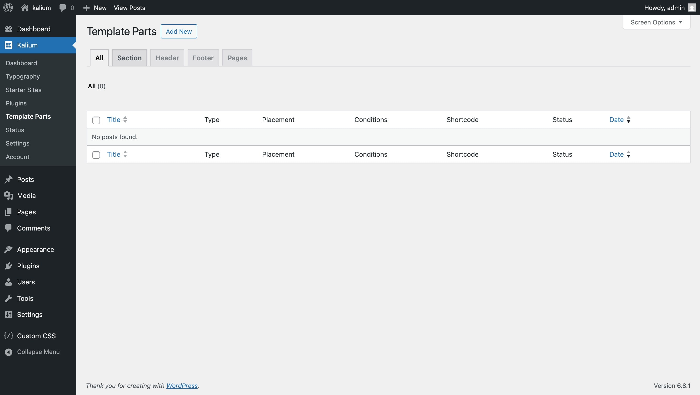

# Creating Template Parts

Now that you’ve learned what Template Parts are and how they work, it’s time to start creating one. Whether you’re adding a custom section, replacing your site’s footer, or building a new layout for your 404 page, the process is simple and familiar.

Template Parts are managed from one place in your WordPress admin — and the interface works just like creating a regular post or page, so it’ll feel familiar right away.

To get started, go to **Kalium → Template Parts** in your dashboard.

<figure><figcaption></figcaption></figure>

***

### Types of Template Parts

There are four types of Template Parts you can create:

* **Section** – Insert content into specific areas of your site using WordPress and plugin hook locations, like before the header, after the content, or between elements on WooCommerce pages.
* **Header** – Use a custom header instead of the default site header.
* **Footer** – Swap out the footer based on the page, user, or even date.
* **Page** – Replace the layout of pages like 404, search results, category archives, and more.

Each type has a specific purpose, and you can create as many as you need depending on the parts of your site you want to customize.

***

### Tabs Overview

At the top of the Template Parts screen, you’ll see a set of tabs that help you filter, organize and view different types of Template Parts.

<figure><figcaption></figcaption></figure>

These tabs make it easier to find what you’re working on, especially if you have a lot of Template Parts.


When adding a new Template Part, it’s helpful to switch to the tab that matches what you’re creating (like **Sections**) before clicking **Add New**. The type will be set automatically based on the tab you’re in — but you can still change it later if needed.


***

Now that you’ve seen how Template Parts are organized and where to find them, let’s go ahead and create our first one.
