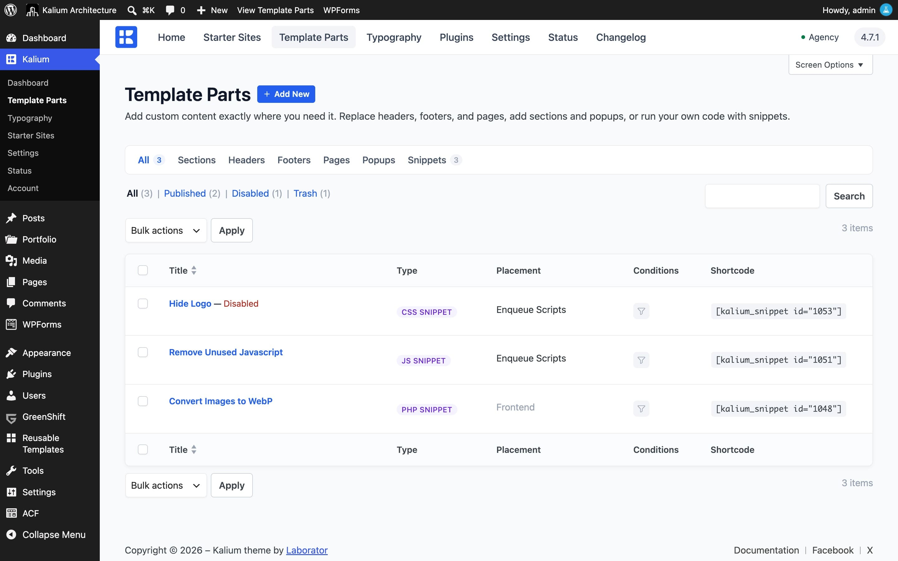
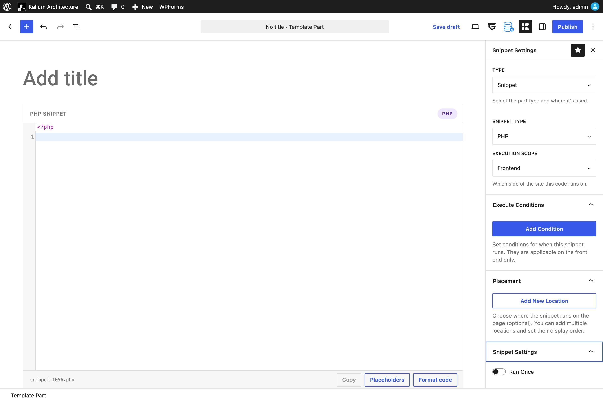
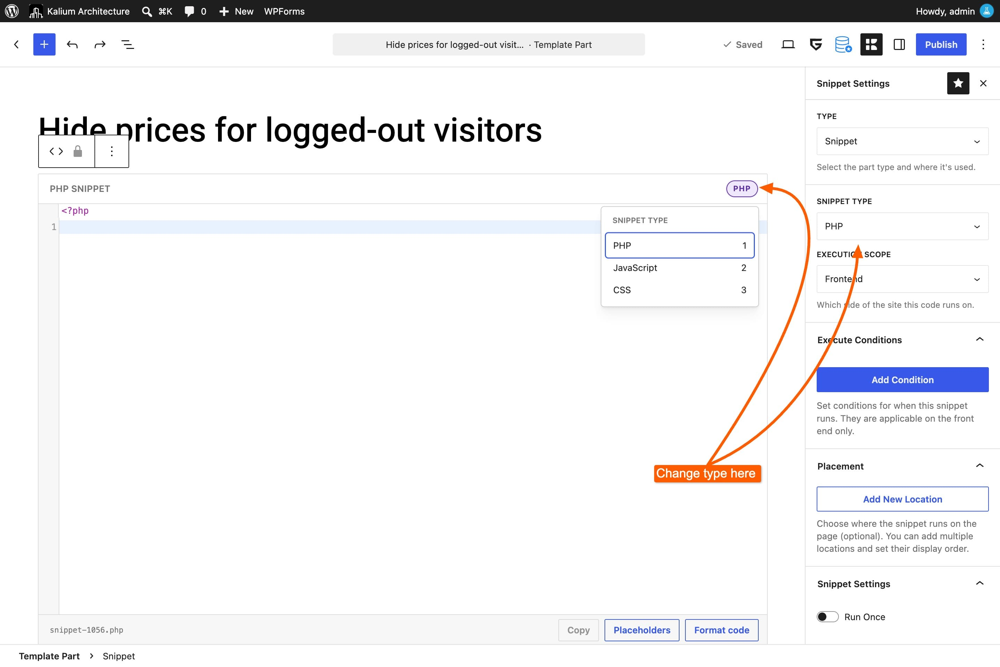
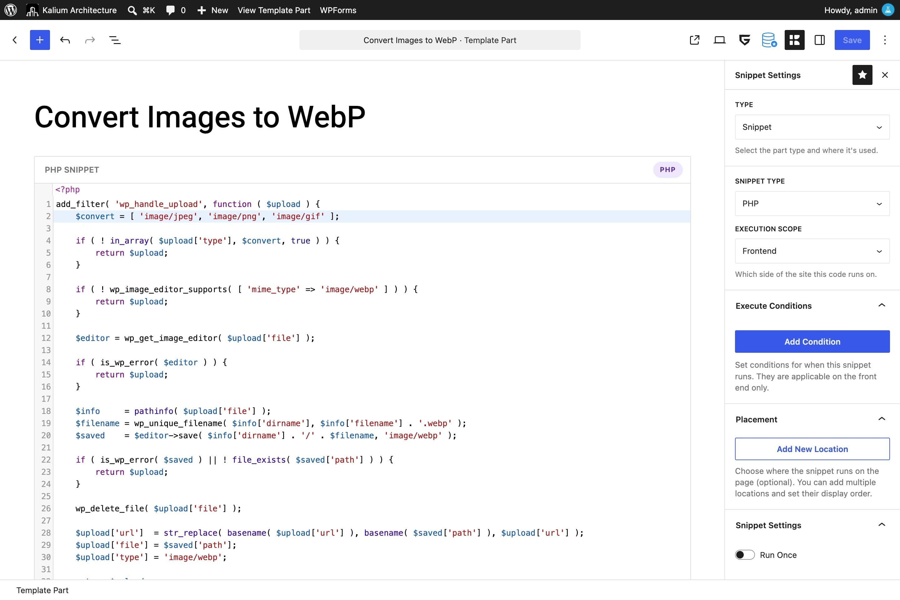
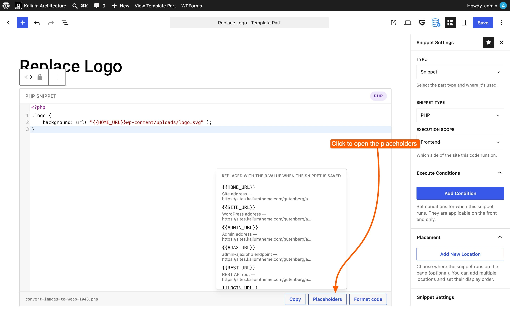

# Code Snippets

Sooner or later, someone tells you to "add this to your functions.php file." It's common advice, and it's a bad idea: theme files are replaced when the theme updates, taking your changes with them, and one typo in that file can take the whole site offline.

**Snippets** are Kalium's answer. A Snippet is a Template Part that holds code instead of layout, a few lines of PHP, a stylesheet, or a script. It lives in your database rather than a theme file, which means:

* **Updates don't touch it.** Update Kalium as often as you like.
* **You can switch it off** from a list, without editing anything.
* **It switches itself off if it breaks**, so a bad snippet cannot take your site down.
* **You don't need a child theme** for small additions.

<figure><figcaption></figcaption></figure>

***

### Before you start

Snippets run real code on your site. That is the point of them, and it is also the reason for a few sensible habits:

* **Only add code you understand or trust.** Code from a support reply or the Kalium documentation is fine. Code from a random forum thread deserves more caution.
* **Add one snippet at a time** and check your site after each. If something breaks, you know which one did it.
* **Writing PHP and JavaScript requires an administrator account.** Other users who can edit Template Parts see those options grayed out and can write CSS only. This is deliberate.


Snippets are part of the Template Parts system, so they need it switched on at **Kalium -> Settings -> Template Parts**. If the **Kalium -> Template Parts** menu is missing entirely, that's the place to look.


***

### Creating a snippet

#### 1. Go to Template Parts

In your WordPress dashboard, go to **Kalium -> Template Parts**, switch to the **Snippets** tab, and click **Add New**.

The editor opens differently from other Template Parts: instead of a blank canvas, you get a single code block with a **Snippet** header and a language badge on the right. Nothing else can be added, a snippet holds code and only code.

<figure><figcaption></figcaption></figure>

***

#### 2. Name it

Give it a name that describes what the code does, not what it is. **Hide prices for logged-out visitors** will still make sense in a year. **Snippet 3** will not.

***

#### 3. Choose the language

Open the Template Part Settings panel with the **Kalium icon** in the top-right corner. Directly under **Type** you'll find **Snippet Type**, offering:

* **PHP**: changes how WordPress behaves
* **CSS**: changes how the site looks
* **JavaScript**: adds behavior in the browser

You can also click the badge on the code block itself to switch. Your code is kept when you change language.

Not sure which you need? A rule of thumb: if it changes how something _looks_, it's CSS. If it changes what your site _does_, it's PHP.

<figure><figcaption></figcaption></figure>

***

#### 4. Write or paste the code

Type or paste your code into the block. The editor highlights it for the language you chose, and the line numbers are the same ones any error message will refer to.

**For PHP, do not type `<?php`.** The opening tag is shown for you on the first line. If you paste code that begins with it, Kalium removes it for you.

**Format code**, in the bar under the editor, tidies your code to WordPress coding standards. It's optional, and it downloads on first use so it needs an internet connection. If your code has a syntax error, the message appears next to this button with the line number.

<figure><figcaption></figcaption></figure>

***

#### 5. Set where it runs

This step depends on the language, and it's the part that most often goes wrong. Each language has its own page:


[php-snippets.md](php-snippets.md)



[css-and-javascript-snippets.md](css-and-javascript-snippets.md)


***

#### 6. Publish

Click **Publish**.

For PHP snippets, Kalium runs a safety check first: it quietly loads a page of your site in the background with the new code active. If the site loads, the snippet is published. **If it doesn't, the snippet stays switched off and you're shown the error and the line number**, your site is never left broken.

***

### Execute Conditions

Every Template Part has Display Conditions. On a Snippet they're called **Execute Conditions**, and they work the same way with one important difference:

**An empty condition list means "no restriction", not "never".** A Section with no conditions never shows. A Snippet with no conditions runs everywhere it's allowed to.

Add conditions when a snippet should only run in some places, a script that belongs on the checkout page, styles that only apply to blog posts.


[display-conditions.md](../../settings/display-conditions.md)


***

### Placeholders

Snippets can include placeholders written as `{{NAME}}`, which are swapped for real values when you save. This keeps site addresses and paths out of your code:

```css
.logo {
	background: url( "{{HOME_URL}}wp-content/uploads/logo.svg" );
}
```

Click **Placeholders** in the snippet's footer to see all 21 with their value on your site, and click one to insert it. They cover your site's addresses (`HOME_URL`, `SITE_URL`, `ADMIN_URL`, `AJAX_URL`, `REST_URL`, `LOGIN_URL`), its folders (`THEME_URL`, `CHILD_THEME_URL`, `CONTENT_URL`, `UPLOADS_URL`, `PLUGINS_URL`), details about the site (`SITE_NAME`, `SITE_DESCRIPTION`, `LOCALE`, `CHARSET`, `WP_VERSION`, `THEME_VERSION`, `YEAR`) and about the snippet itself (`SNIPPET_ID`, `SNIPPET_SLUG`, `RANDOM_ID`).

<figure><figcaption></figcaption></figure>


Because values are filled in when you save, **moving your site to a new address means saving your snippets again** so they pick up the new one. Kalium regenerates them on its own when it notices the mismatch, but a manual save is the quick fix if a path looks wrong.


***

### Using a snippet inside a page

Every snippet has a shortcode, shown in the **Shortcode** column of the list:

```
[kalium_snippet id="123"]
```

Drop it into any post or page to run the snippet at that spot. PHP output is printed in place.

***

### Managing snippets

The Template Parts list is where you work day to day:

* **Enable / Disable**: switch a snippet off without deleting it. The first thing to try when something goes wrong.
* **Duplicate**: copy a snippet before experimenting. The copy is created as Disabled with "(Copy)" in the title, keeping all its settings.
* **Status**: shows Published, Disabled, or **Error**. Hover an Error for the message and line number.

***

### If something goes wrong

Snippets are built so a mistake is recoverable. If your site is misbehaving after adding one, or you can't reach your admin at all, there is a way back:


[troubleshooting-snippets.md](troubleshooting-snippets.md)

