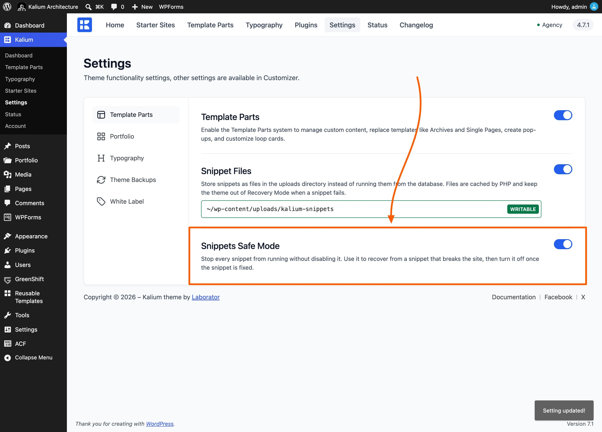

# When a Snippet Goes Wrong

Snippets are built on the assumption that code sometimes breaks. Kalium has several layers of protection, and knowing them means you never have to panic about a bad snippet.

**Start here:** in almost every case, the fix is to open **Kalium -> Template Parts -> Snippets** and set the offending snippet to **Disabled**. Nothing is deleted and your site returns to normal immediately.

***

### The protection you get

You don't have to do anything to get these. They're always on.

**A syntax error is caught when you save.** The save is refused, the error names the line, and your code stays in the editor. Nothing reaches your site.

**Publishing is tested first.** Publishing a PHP snippet (or updating a published one, or enabling one from the list) loads a page of your site in the background with the code active. If it fails, the snippet stays off and you're shown the error.

**A failure switches the snippet off.** If a snippet fails while your site is running, Kalium disables it there and then. The page finishes loading, the list shows an **Error** status, and a notice appears in your admin. Hover the Error for the message and line number.

**Even the worst failures are handled.** For the rare kind PHP cannot recover from (running out of memory, for instance) visitors see a brief "please reload" page once, and the snippet is disabled the same way.

***

### Snippets Safe Mode

Sometimes a snippet doesn't crash the site but breaks something in a way you need to investigate, and you'd rather stop all snippets while you work out which one it is.

**Kalium -> Settings -> Template Parts -> Snippets Safe Mode** stops **every** snippet from running, without disabling any of them. Your snippets stay exactly as they are; they simply don't run while it's on.

A yellow notice appears on the Template Parts screens to remind you.

<figure><figcaption></figcaption></figure>

Turn it on, confirm the problem goes away, then re-enable your snippets one at a time until it returns. The last one you enabled is the culprit.

***

### If you can't reach your admin at all

This is the situation people worry about, so here is the way out. It needs access to your site's files, through your hosting file manager or FTP.

1. Open the file `wp-config.php` in your site's main folder
2. Add this line **above** the line that says `/* That's all, stop editing! */`:

```php
define( 'KALIUM_SNIPPETS_SAFE_MODE', true );
```

3. Save the file

Every snippet stops running and your admin is reachable again. Fix or disable the snippet that caused it, then **remove the line** to bring your other snippets back.


While that line is in `wp-config.php`, the Safe Mode switch in **Kalium -> Settings** cannot turn snippets back on, the file wins. Remember to take the line out once you're done.



[child-theme.md](../../../getting-started/installation/child-theme.md)


***

### Working through a problem

#### A snippet switched itself to Disabled

It failed while running. Hover the **Error** status in the list for the message and the line number, fix the code, and publish again.

#### Publishing is refused

Read the message. It tells you which of two things happened. Either your code has a syntax error on the line named, or the safe activation check found your site doesn't load with the code active. Both point at the code.

#### A PHP snippet does nothing

Work down this list:

1. Is it **Published**, and not showing **Error**?
2. Is **Snippets Safe Mode** off?
3. Check **Execution Scope**, a _Frontend_ snippet never runs in the admin, and an _Admin_ one never runs on your public site.
4. If it has a **Placement**, try removing it. Locations that fire very early in the page never run snippets.

#### A CSS or JavaScript snippet does nothing

Almost always **Placement**. Styles and scripts need one. Set it to **Enqueue Scripts** from the **Head** group. An empty placement means the code is never attached to the page.

#### The snippet runs twice

Two placements are firing on the same page. Turn on **Run Once** under Snippet Settings.

#### A path or address in my snippet is wrong after moving the site

Placeholders like `{{HOME_URL}}` are filled in when a snippet is saved, so they still hold the old address. Open the snippet and save it again to refresh them. Kalium regenerates them on its own too, but saving is the quick fix.

#### I don't see Enqueue as File

**Snippet Files** is off, or the folder `wp-content/uploads/kalium-snippets/` isn't writable. **Kalium -> Settings -> Template Parts** shows which, the line under the setting reports whether the folder can be written to. Snippets still work either way; they just run from the database.

#### I can't choose PHP or JavaScript

Those require an administrator account. Users who can edit Template Parts but aren't administrators can write CSS snippets only.

***

### Good habits

* **Add one snippet at a time** and check your site after each. Then you always know what changed.
* **Use the Duplicate action before experimenting.** The copy is created Disabled with all its settings, so you can edit freely and keep the original as a fallback.
* **Name snippets by what they do.** When you're disabling things to find a problem, useful names save real time.
* **Disable rather than delete.** A disabled snippet costs nothing and can be turned back on.
