# Creating a Section

Sections let you insert custom content into specific parts of your site — like above the header, below the content, or inside WooCommerce product pages. These are placed using WordPress and plugin hook locations, and you can decide exactly when and where they appear using display conditions.

In this example, we’ll create a banner that displays after the header across the entire site.

***

### 1. Go to Template Parts

In your WordPress dashboard, go to **Kalium → Template Parts**.

Switch to the **Sections** tab at the top, then click **Add New** in the top-left corner.

<figure>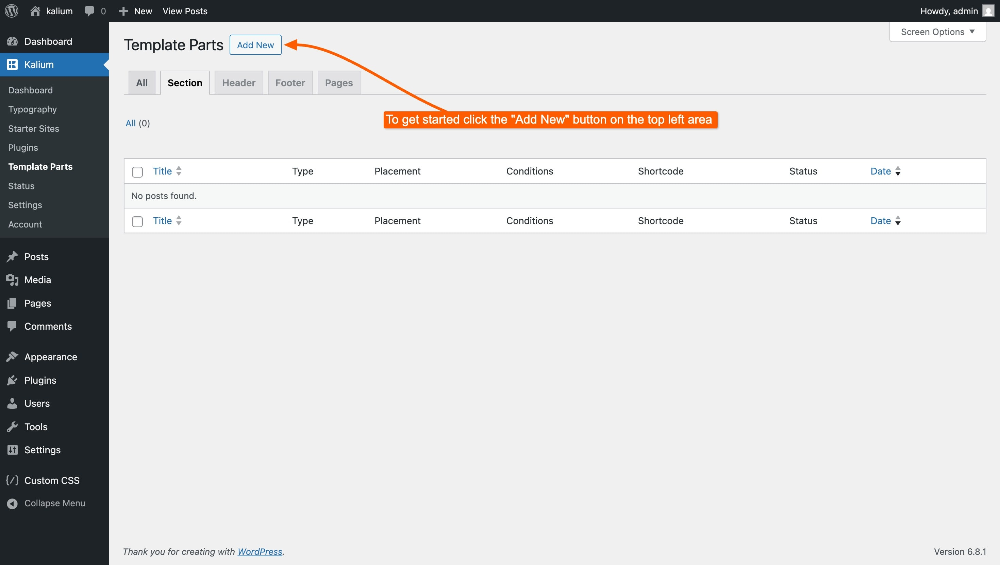<figcaption></figcaption></figure>

***

### 2. Create the Section

Enter a name for your section. For example: **30% Off Summer Sale Banner**

Now add your content in the editor. This can be anything — a short message, a call-to-action, a promotional banner, or even a more complex layout with images and buttons.

<figure>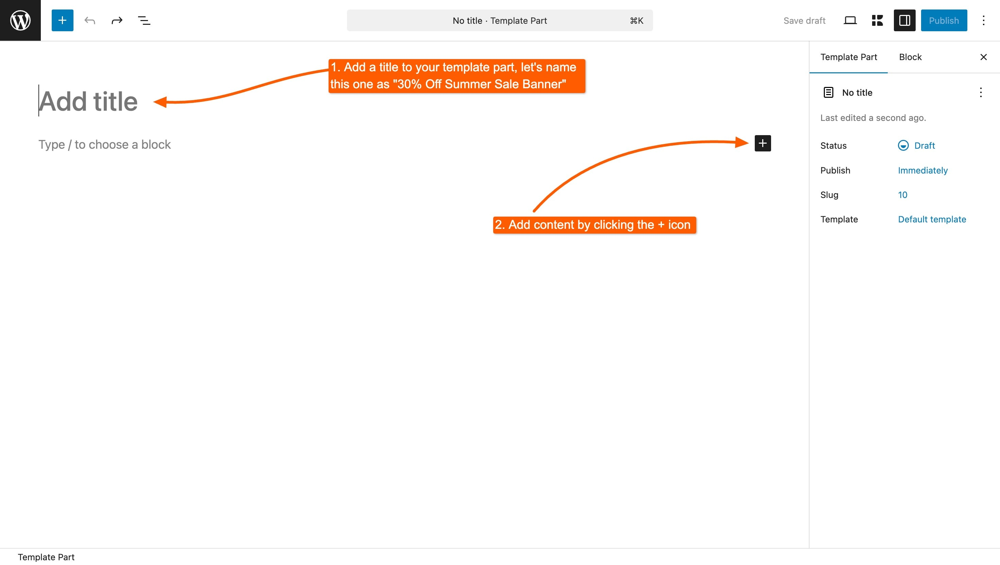<figcaption></figcaption></figure>

In this example, we’ll use the default WordPress editor (Gutenberg) to build the section. If you prefer using **Elementor** or **WPBakery**, please check the respective articles:


[creating-a-section-with-elementor.md](creating-a-section/creating-a-section-with-elementor.md)



[creating-a-section-with-wpbakery.md](creating-a-section/creating-a-section-with-wpbakery.md)


***

### 3. Open Template Part Settings

Click the **Kalium icon** in the top-right corner to open the **Template Part Settings** panel.

<figure>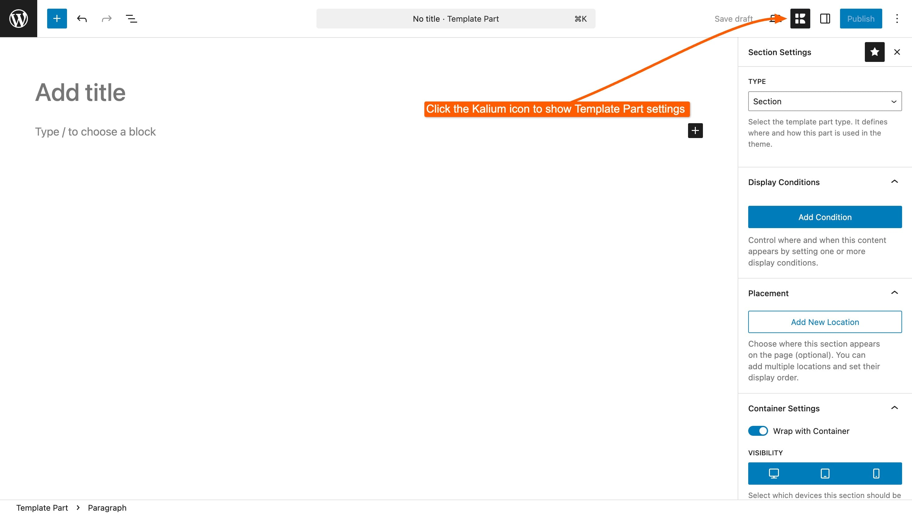<figcaption></figcaption></figure>

***

### 4. Set the Type

Make sure the **Type** is set to **Section**.\
If it's not, switch it manually — otherwise the section may not behave as expected.

<figure>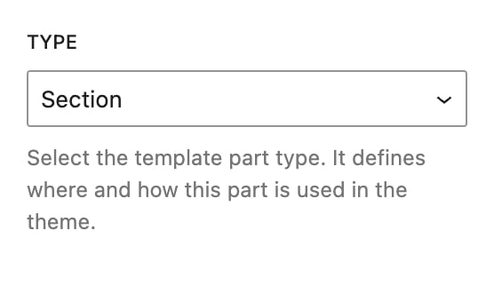<figcaption></figcaption></figure>

For a complete overview of all types and how to use them, see the article below:


[type.md](../settings/type.md)


***

### 5. Set Display Conditions

Click **Add Condition** to choose where this section should appear.

<div><figure>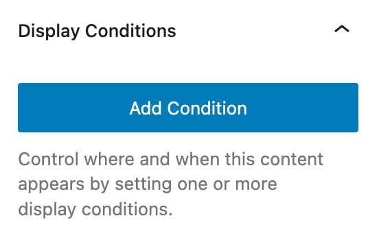<figcaption></figcaption></figure> <figure>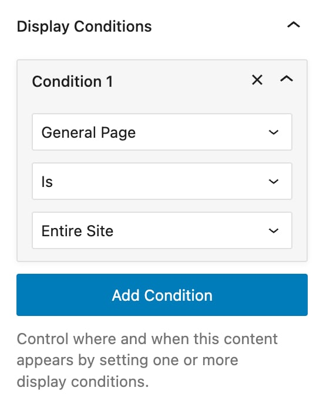<figcaption></figcaption></figure></div>

For this example, we want the banner to show across the entire site:

* Set **General Page** → **Is** → **Entire Site**

You can always add more than one condition and combine them using **AND** or **OR** logical operators to create more advanced specific rules.

For a complete overview of all condition types and how to use them, see the article below:


[display-conditions.md](../settings/display-conditions.md)


***

### 6. Choose Placement

This setting is available only for **Sections**.

Click **Add New Location** to choose where the section appears on the page.

You can:

* Select from a list of predefined hook locations
* Search within the list
* Or click the **target icon** to open a visual popup where you can select the exact area

<figure>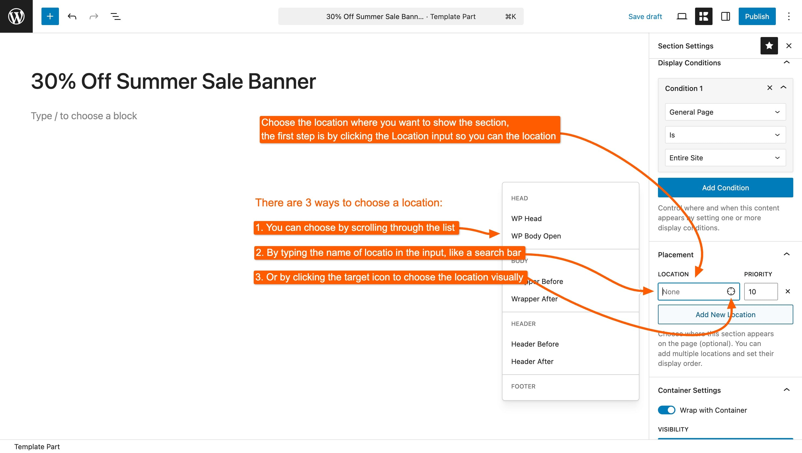<figcaption></figcaption></figure>

For this example, choose **Header After**.

<figure>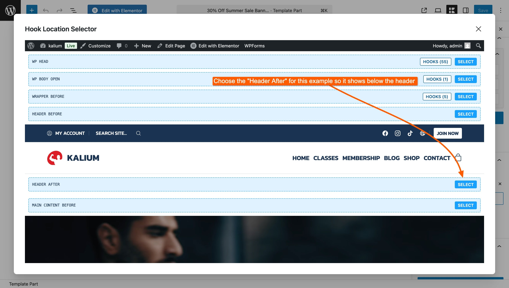<figcaption></figcaption></figure>


Want to see the same hook locations as shown in the popup — but live on your site?\
Just add `?view-theme-hooks=1` to the end of any page URL. This will display all available hook positions directly on the front end, exactly like the visual overlay in the Placement popup above. It's a helpful tool for advanced placement and testing.


Leave the **Priority** set to `10` unless you need to control the display order of multiple sections targeting the same location.

Sections with **lower priority numbers** appear first. For example, a section with priority `5` will show before one with priority `10` in the same hook location.

This is especially useful when you're stacking multiple sections in the same area (e.g. adding a notice above a banner).

***

### 7. Container and Visibility Options

Under **Container Settings**, you can fine-tune how your section is wrapped and displayed:

* **Wrap with Container** – This is enabled by default. Turn it off if you want your content to stretch full-width or appear without wrapper elements.
* **Visibility** – Choose whether the section appears on desktop, tablet, mobile — or all.
* **Container Classes** – You can enter a class like `container` if you want the content to follow your site’s layout width. For this example, leave it blank.
* **Tag Name** – You can optionally set a semantic HTML tag like `<aside>` or `<section>`. By default, this is set to `<div>`, so you can leave it empty.

<div><figure>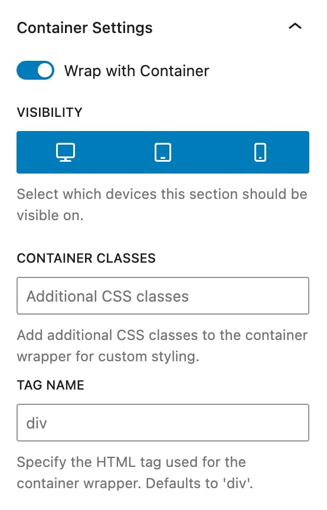<figcaption></figcaption></figure> <figure>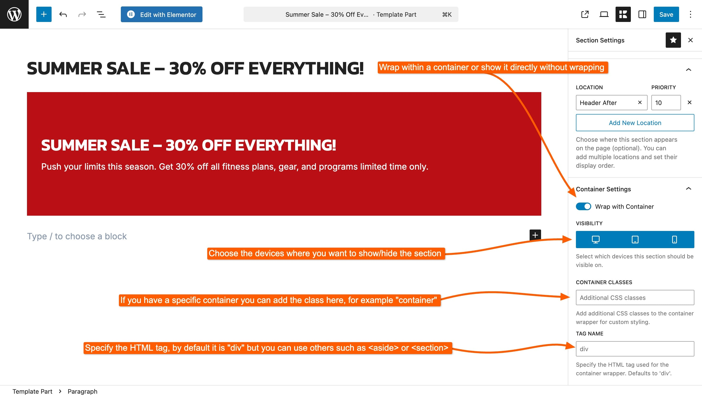<figcaption></figcaption></figure></div>

***

### 8. Publish

Once everything is configured, click **Publish**.

<figure>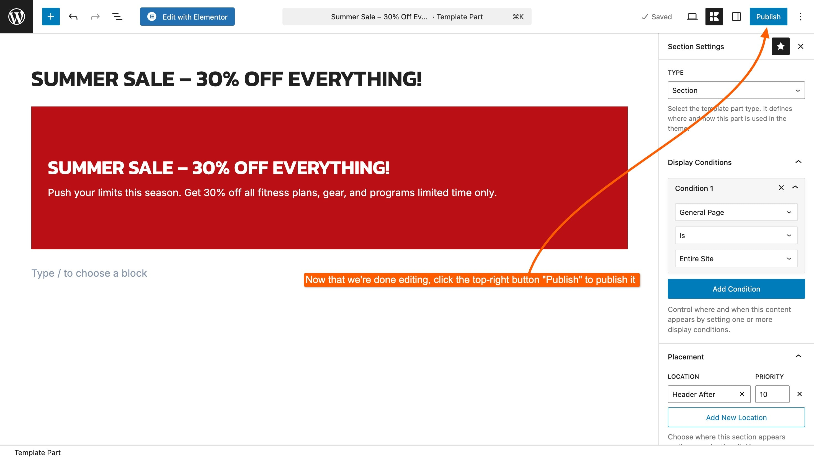<figcaption></figcaption></figure>

Your section will now appear after the header on every page of your site, based on the conditions and placement you selected, as you can see below:

<figure>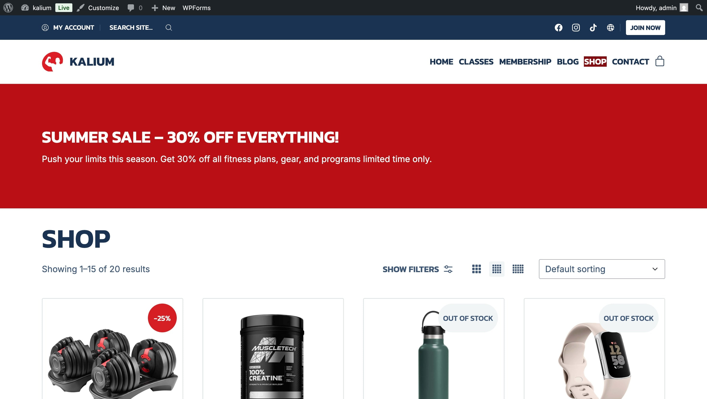<figcaption></figcaption></figure>

***

### Optional: Insert the Section Manually

In addition to automatic placement, Kalium lets you manually insert Template Part sections anywhere inside a page or post using the default editor.

This is especially useful when you want to show a section in a very specific spot, without relying on automatic placement rules.

It only applies to **Sections**, since they’re designed to be embedded within content. Other types like **Headers**, **Footers**, and **Pages** replace parts of your site and can’t be inserted manually.

Below, we’ll explain how to insert sections manually using each method.

#### Why use this?

* **Visual placement** – Drop the section exactly where you want in your design
* **Simple selection** – Choose any existing section from the dropdown
* **No display rules needed** – Skip conditions and hook settings if you want manual control

To insert a section manually in Gutenberg:

1. Edit your page or post in the Gutenberg editor.
2. Click the **“+” icon** to add a block.
3. Search for **Content Section** and select the block.
4. In the block settings, choose the section you want to display from the dropdown.

***

#### Optional: Shortcode Option

If you prefer, you can insert any Template Part Section using a shortcode.

**Shortcode format:**

```
[kalium_section id="123"]
```

You don’t need to look up the ID manually — the shortcode is already visible next to each Template Part in the **Template Parts** dashboard. Just copy and paste it wherever you need.

#### Controlling Display Conditions

You can control whether the shortcode respects the section’s display conditions by adding the `check_conditions` parameter:

* `check_conditions="yes"` – The section will only appear if its display conditions are met
* `check_conditions="no"` – The section will appear unconditionally, wherever the shortcode is placed

**Example**:

```
[kalium_section id="123" check_conditions="no"]
```

This is useful if you're placing the section inside:

* Widgets
* Custom HTML areas
* Third-party shortcode-compatible plugins
