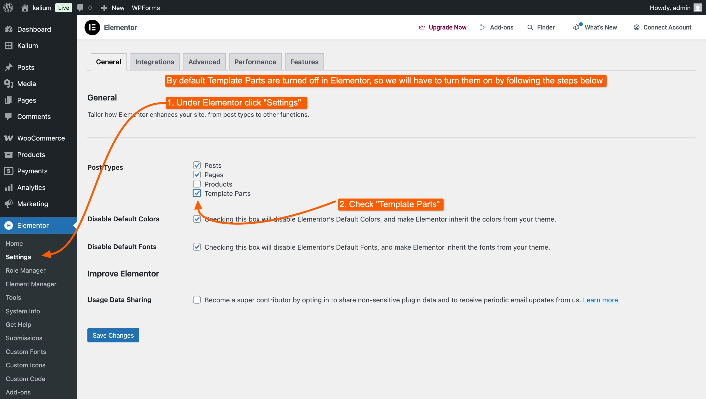
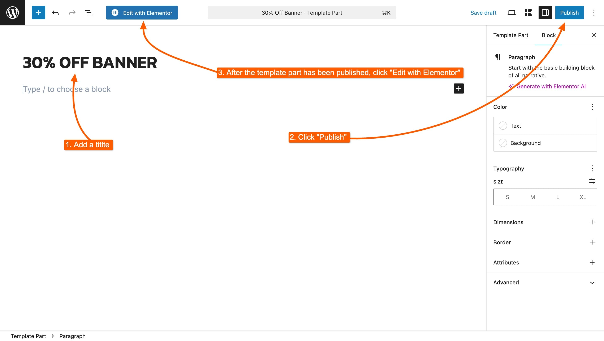
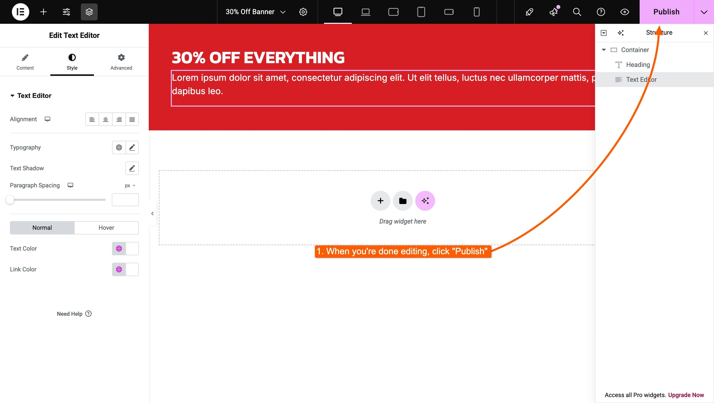
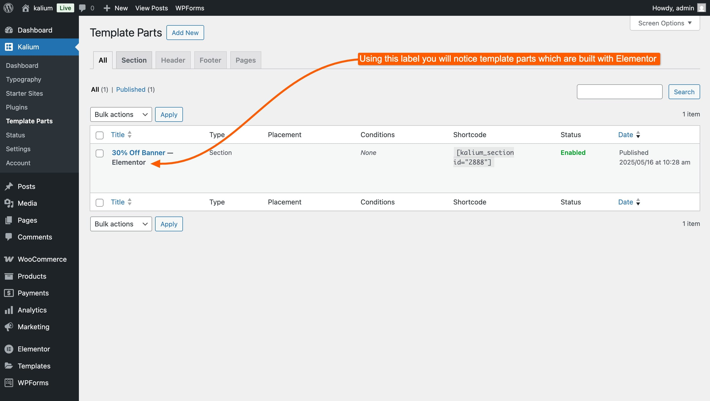
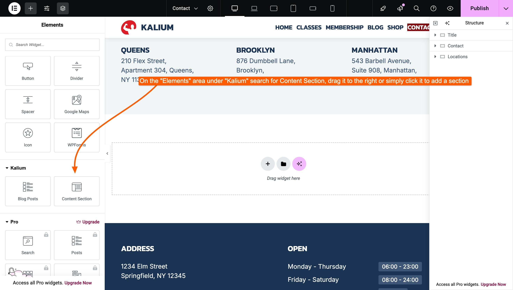
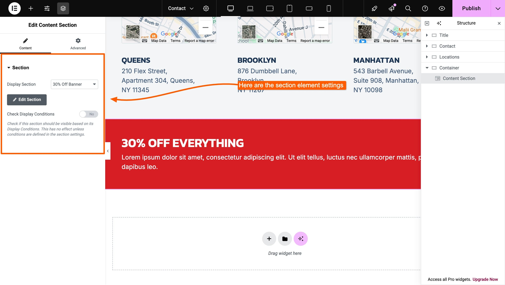
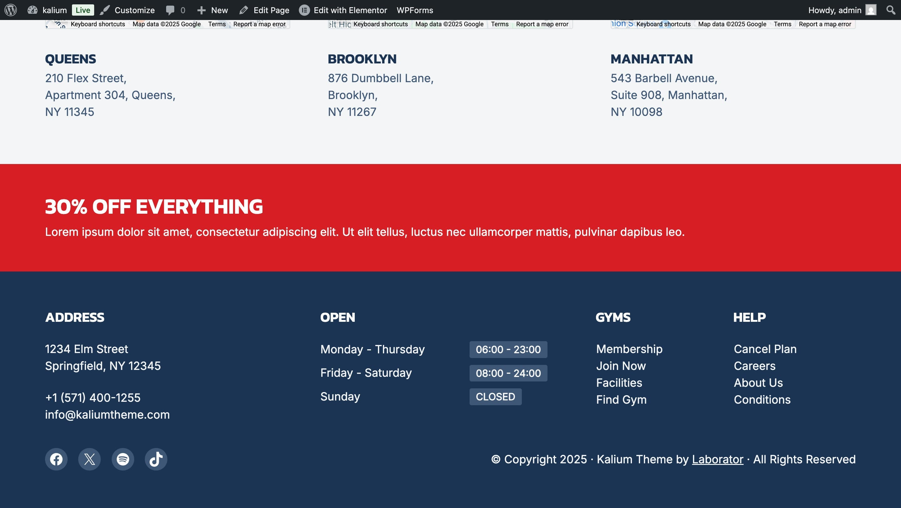

# Creating a Section with Elementor



Template Parts work seamlessly with Elementor and allow you to visually build custom sections and place them anywhere on your site — all without needing **Elementor Pro**. This gives you theme-builder-level flexibility, built directly into Kalium.

In this example, we’ll walk through how to create a **Section** using Elementor.&#x20;

***

### 1. Enable Template Parts in Elementor

By default, Template Parts are not editable with Elementor unless you enable the option manually.

To do that:

1. Go to **Elementor → Settings**
2. Under the **Post Types** section, make sure **Template Parts** is checked
3. Click **Save Changes**

<figure><figcaption></figcaption></figure>

***

### 2. Create the Section

Now that Elementor can edit Template Parts, you’re ready to create one:

1. Go to **Kalium → Template Parts**
2. Click **Add New**
3. Add a title for your section (e.g. `30% Off Banner`)
4. Click **Publish**


&#x20;You can set up **Display Conditions**, **Placement**, and **Container Settings** now or later — the process is the same as when using Gutenberg.


<figure><figcaption></figcaption></figure>

***

### 3. Edit with Elementor

Once the Template Part has been published, you’ll see the **Edit with Elementor** button appear.

Click it to open the section in the Elementor editor.


If the **Edit with Elementor** button doesn't show up, it means Template Parts are not enabled in **Elementor → Settings**. Make sure the checkbox is active under **Post Types**.


***

### 4. Add Your Content

Now you're in the Elementor editor.

1. Add your content — for this example, we’ve added a banner block announcing a **30% Sale**
2. Design the section as you like
3. When finished, click **Publish**

<figure><figcaption></figcaption></figure>

***

### 5. Check Your Section

Return to **Kalium → Template Parts** and you'll see your newly created section listed with an **Elementor** label. This means the section was built using Elementor and can be edited with it any time.

<figure><figcaption>
The "Elementor" label shows after the section title, so you will know it's built with Elementor
</figcaption></figure>

***

### Optional: Insert the Section Manually

The **Content Section** element in Elementor lets you easily insert any section of Template Parts directly into your layout — no need to configure display conditions or placement settings.

#### Why use this?

* **Visual placement** – Drop the section exactly where you want in your design
* **Simple selection** – Choose any existing section from the dropdown
* **No display rules needed** – Skip conditions and hook settings if you want manual control

**To use it:**

1. Edit any page with Elementor.
2.  In the Elements panel, search for **Content Section** under the **Kalium** category. 

    <figure><figcaption>
Click the "Content Section"
</figcaption></figure>
3. Drag the element into the desired spot in your layout.
4.  In the Content Section settings, you'll find: 

    <figure><figcaption></figcaption></figure>

    * **Display Section** – Select the section you want to show.
    *   **Check Display Conditions** – Enable this to respect the section’s Display Conditions. 

        > Check if this section should be visible based on its Display Conditions. This has no effect unless conditions are defined in the section settings.\
        > \
        > If you leave **Check Display Conditions** off, the section will always appear wherever you’ve placed it.
5. When you're done editing click **Publish**

And this is how it looks in the page we have added:

<figure><figcaption>
And here is the final result, we have added the section created with Elementor in Contact page
</figcaption></figure>
