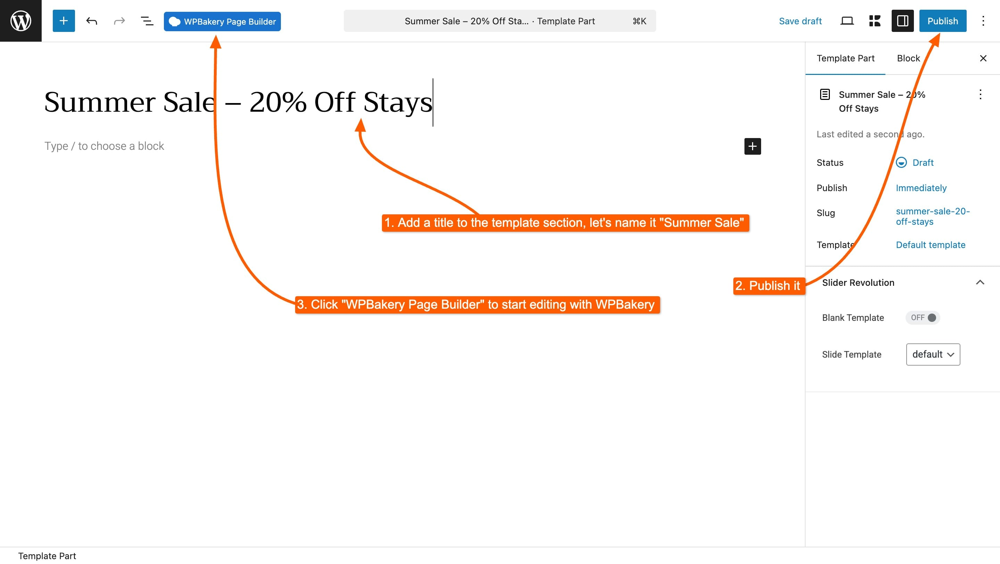
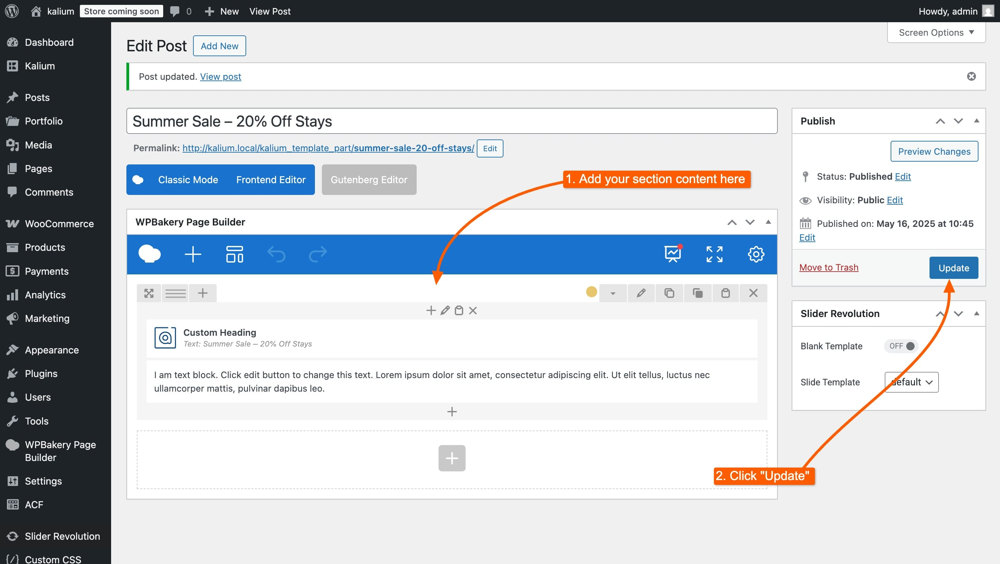
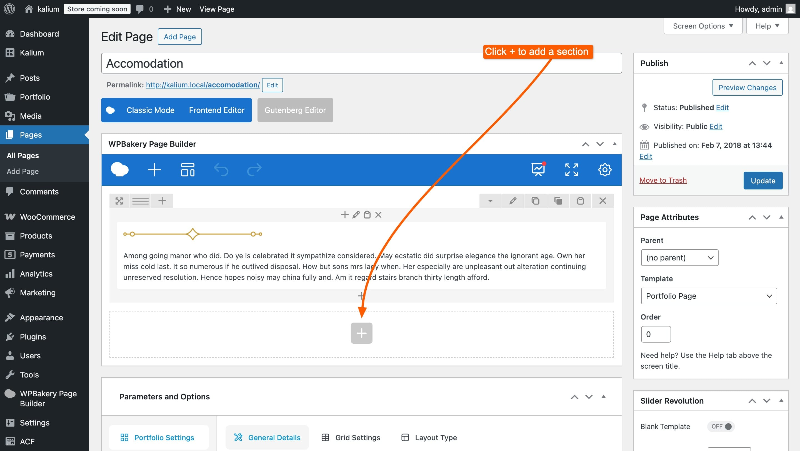
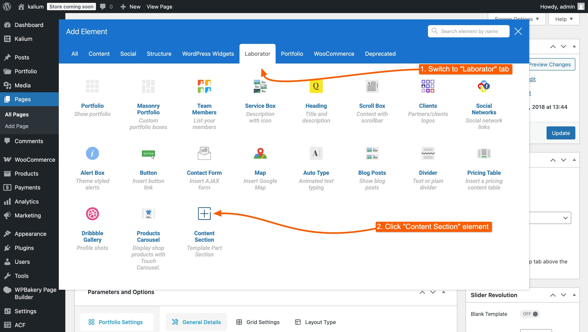
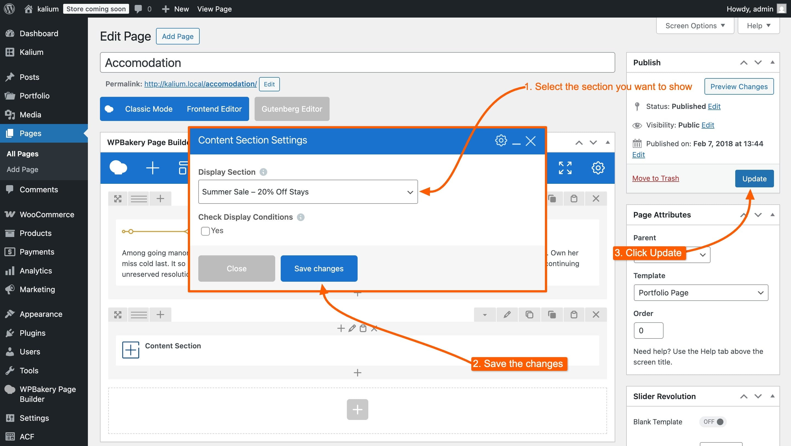

# Creating a Section with WPBakery



Template Parts work seamlessly with **WPBakery Page Builder**, allowing you to visually build custom sections and place them anywhere on your site — without needing extra plugins or complex configuration. It’s a theme-builder-like experience built right into Kalium.

In this example, we’ll walk through how to create a **Section** using WPBakery.&#x20;

***

### 1. Create the Section

To begin:

1. Go to **Kalium → Template Parts**
2. Click **Add New**
3. Add a title for your section (e.g. `Summer Sale - 20% Off`)
4. Click **Publish**


You can configure **Display Conditions**, **Placement**, and **Container Settings** now or later — the process is the same regardless of the builder you use.


<figure><figcaption></figcaption></figure>

***

### 2. Edit with WPBakery

After publishing, click the **Edit with WPBakery Page Builder** button to open the section in the visual editor.


If the **Edit with WPBakery** button doesn’t appear, go to **WPBakery → Role Manager**, and make sure Template Parts are enabled under **Post Types**.


***

### 3. Add Your Content

Now you're inside the WPBakery editor.

1. Add your content — for this example, we’ve used a banner with a call-to-action
2. Design the layout and styling as needed
3. When you're done, click **Update**

<figure><figcaption></figcaption></figure>

That’s it, you’ve successfully created a reusable Template Part section using WPBakery. It can now be displayed automatically using placement and display conditions, or inserted manually anywhere on your site.

***

### Optional: Add the Section Manually

The **Content Section** element in WPBakery lets you insert any Template Part section directly into your layout — without needing to set up display conditions or placement rules.

#### Why use this?

* **Visual placement** – Drop the section exactly where you want on the page
* **Simple selection** – Choose from your existing Template Part sections
* **No display logic required** – Skip conditions and hook settings for full manual control

**To insert a Section manually:**

1.  Edit the page using WPBakery.\

    <figure><figcaption></figcaption></figure>
2.  Click **Add Element** and search for **Content Section** under **Laborator** tab.\

    <figure><figcaption></figcaption></figure>
3.  Select the section you want to display using the **Display Section** dropdown.\

    <figure><figcaption></figcaption></figure>
4.  Enable **Check Display Conditions** if you want the section to respect its defined visibility rules.

    > _Check if this section should be visible based on its Display Conditions. This has no effect unless conditions are defined in the section settings._

5. Save the changes and click **Update**

You can place this element anywhere in your layout, below you can see how it looks live:

<figure><figcaption>
Live preview of the section we just added
</figcaption></figure>
