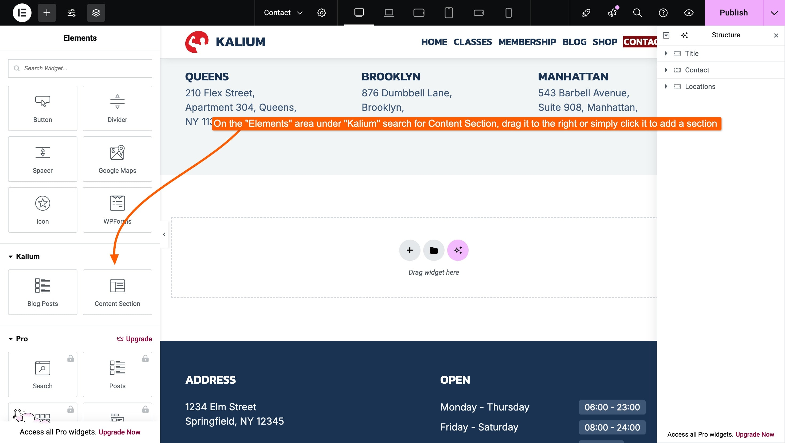
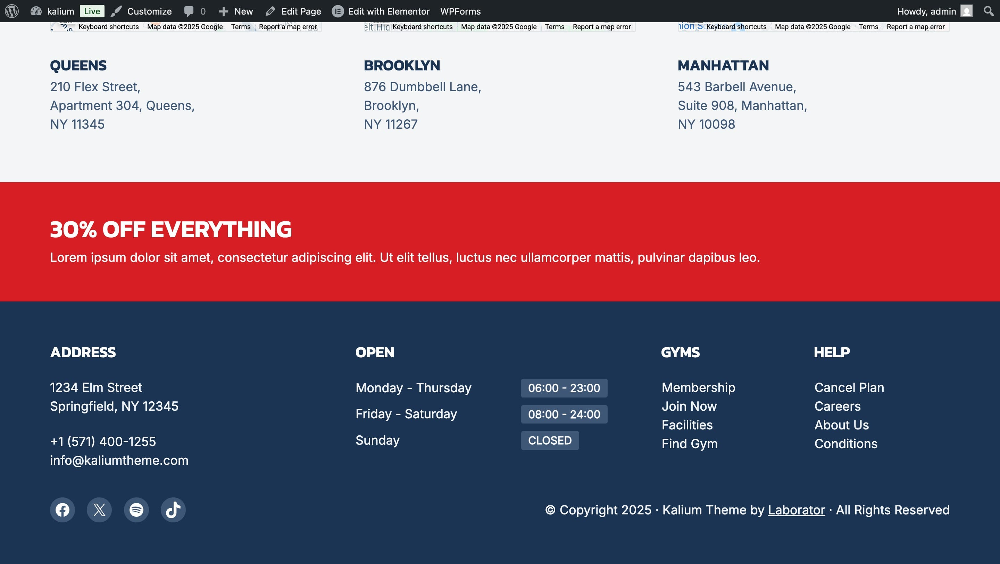
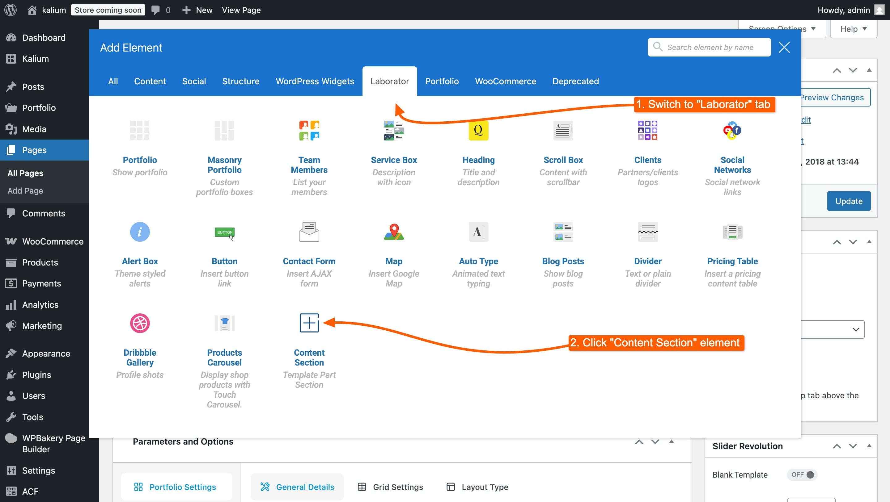
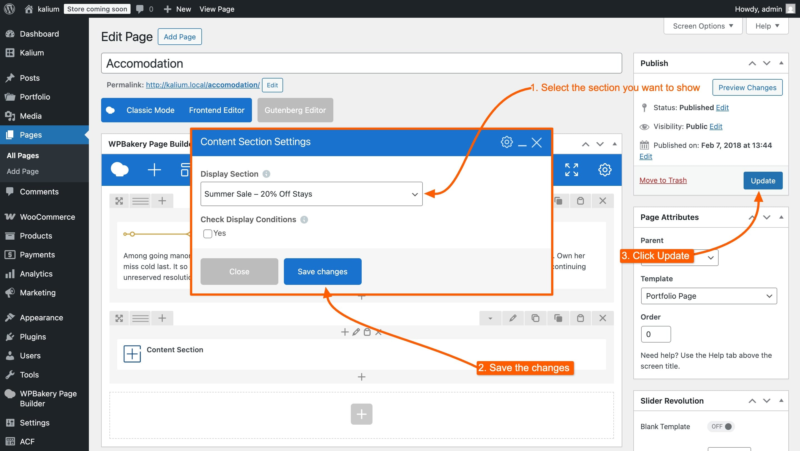

# Insert a Content Section Manually

While Template Parts are usually placed using display conditions and hook locations, Kalium also gives you full control to manually insert them inside any page or post — if you're using **Sections**.

This is especially useful when you want to show a section in a very specific spot, without relying on automatic placement rules.

Manual insertion is only supported for **Sections**, as they are designed to be embedded within content. Other Template Part types — like **Headers**, **Footers**, and **Pages** — are meant to replace entire sections of your site and cannot be inserted manually.

Kalium includes dedicated options for **Gutenberg**, **Elementor**, and **WPBakery**, as well as a shortcode that can be used anywhere shortcodes are supported.

Below, we’ll explain how to insert sections manually using each method.

***

### Gutenberg

For users working in the native WordPress editor, Kalium provides a **Content Section** **block** that lets you manually insert a section into any page or post.

To insert a section manually in Gutenberg:

1. Edit your page or post in the Gutenberg editor.
2. Click the **“+” icon** to add a block.
3. Search for **Content Section** and select the block.
4. In the block settings, choose the section you want to display from the dropdown.

This is useful when you want to insert the section exactly where you want — independent of display conditions or placement settings.


***

### Elementor

Kalium includes a custom widget for Elementor called **Content Section**, designed specifically for adding Template Part Sections manually.

To use it:

1. Edit your page with Elementor.
2.  In the widget panel, search for **Content Section** under the **Kalium** category.\


    <figure><figcaption><p>Click the "Content Section"</p></figcaption></figure>
3. Drag the widget into the desired spot in your layout.
4.  In the widget settings, you'll find:\


    <figure><figcaption></figcaption></figure>

    * **Display Section** – Select the section you want to show.
    *   **Check Display Conditions** – Enable this to respect the section’s Display Conditions.\


        > Check if this section should be visible based on its Display Conditions. This has no effect unless conditions are defined in the section settings.\
        > \
        > If you leave **Check Display Conditions** off, the section will always appear wherever you’ve placed it.
5. When you're done editing click **Publish**

And this is how it looks in the page we have added:

<figure><figcaption><p>And here is the final result, we have added the section created with Elementor in Contact page</p></figcaption></figure>


***

### WPBakery

If you’re using WPBakery Page Builder, Kalium includes a dedicated element called **Content Section**, available under the **Kalium** elements tab.

To insert a Section manually:

1.  Edit the page using WPBakery.\


    <figure><figcaption></figcaption></figure>
2.  Click **Add Element** and search for **Content Section** under **Laborator** tab.\


    <figure><figcaption></figcaption></figure>
3.  Select the section you want to display using the **Display Section** dropdown.\


    <figure><figcaption></figcaption></figure>
4.  Enable **Check Display Conditions** if you want the section to respect its defined visibility rules.

    > _Check if this section should be visible based on its Display Conditions. This has no effect unless conditions are defined in the section settings._


5. Save the changes and click **Update**

You can place this element anywhere in your layout, below you can see how it looks live:

<figure><figcaption><p>Live preview of the section we just added</p></figcaption></figure>

***

### Shortcode Option

If you prefer, you can insert any Template Part Section using a shortcode.

**Shortcode format:**

```
[kalium_section id=“123”]
```

You don’t need to look up the ID manually — the shortcode is already visible next to each Template Part in the **Template Parts** dashboard. Just copy and paste it wherever you need.

This is useful if you're placing the section inside:

* Widgets
* Custom HTML areas
* Third-party shortcode-compatible plugins
