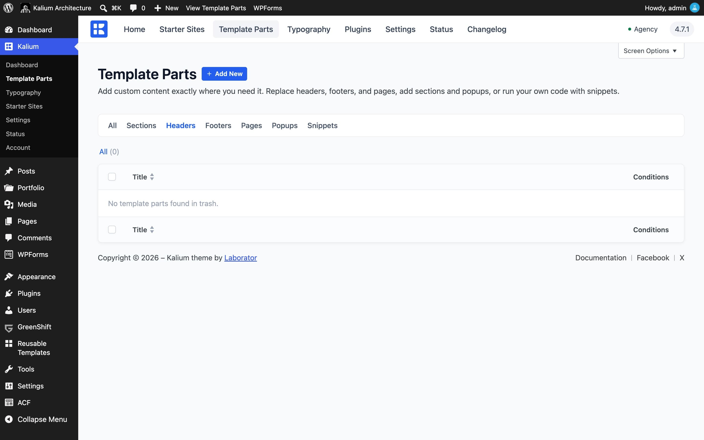
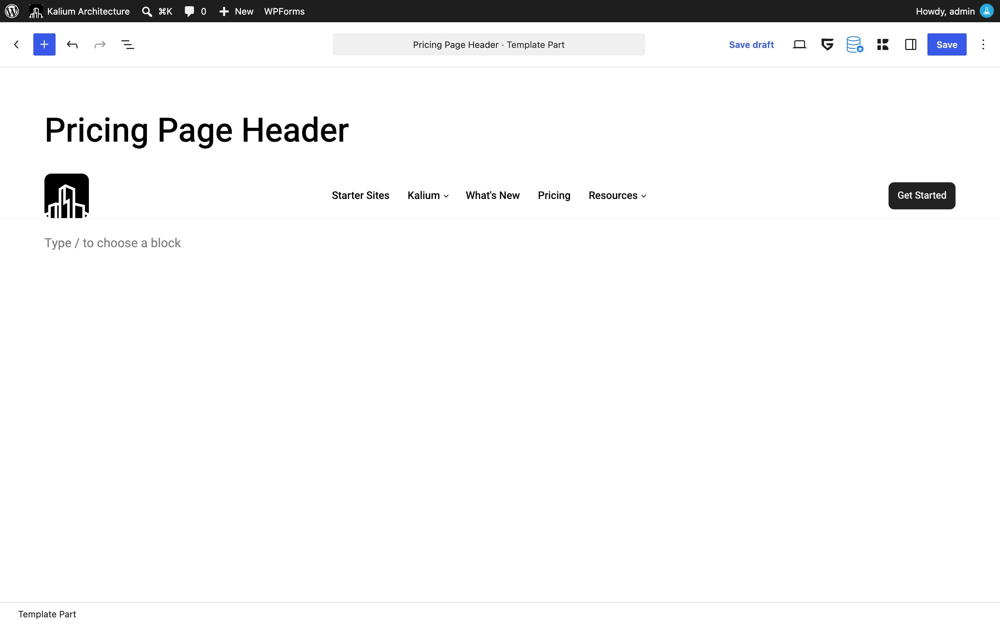
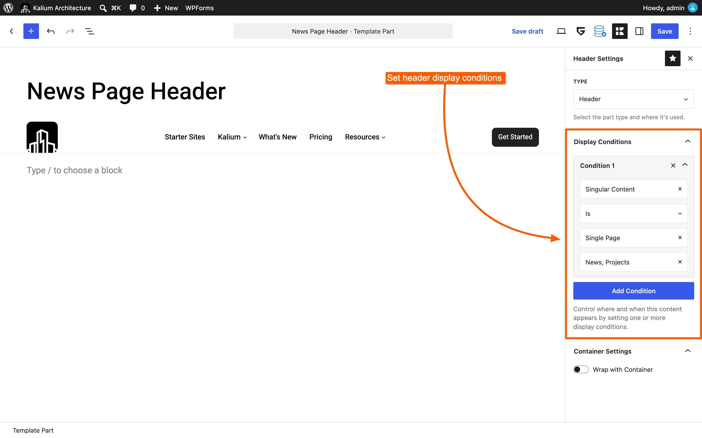
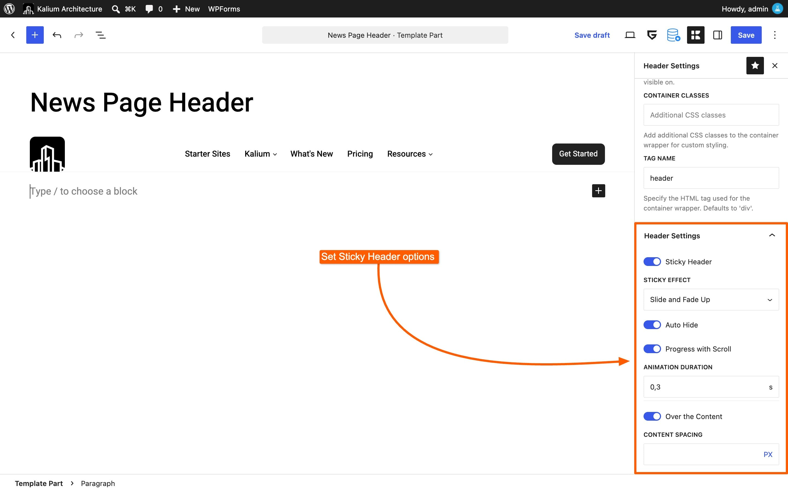

# Replace the Header

Your site already has a header, set up under **Appearance -> Customize -> Header**. That header applies everywhere. A **Header** template part lets you build a second one and use it only where you want it, a slim header for landing pages, a header with a phone number for the contact page, or a completely different header for one section of the site.

Where a Header template part applies, it **replaces** the Customizer header entirely. Both do not show at once.


If you only want to change the logo, the sticky behavior or the colors on one page, you do not need a template part. Open that page and use the **Header** tab in Parameters and Options instead. See [In Page Options](../../general/header/in-page-options.md).


***

### 1. Go to Template Parts

In your WordPress dashboard, go to **Kalium -> Template Parts**.

Switch to the **Headers** tab at the top, then click **Add New** in the top-left corner.

<figure><figcaption></figcaption></figure>

***

### 2. Name it and build the header

Give it a name that says where it will be used, such as **Pricing Page Header**.

Now build the header in the editor. You can use the block editor, Elementor or WPBakery, whatever you normally build with. A header is ordinary content, so anything you can lay out on a page you can lay out here: a logo image, a menu block, a button, a row of contact details.

<figure><figcaption></figcaption></figure>


Building a header from scratch is not the only option. If your custom header only needs different **elements** (a search icon, a cart, a second menu) the drag-and-drop builder under **Appearance -> Customize -> Header -> Custom Header** may be a faster route. See [Custom Header](../../general/header/custom-header/).


***

### 3. Open Template Part Settings

Click the **Kalium icon** in the top-right corner to open the **Template Part Settings** panel.

***

### 4. Set the Type to Header

Make sure **Type** is set to **Header**. If you started from the Headers tab it is already set.

Switching the type changes which settings appear below, so set this first.


[type.md](../settings/type.md)


***

### 5. Set Display Conditions

This is the important step. **Display Conditions decide which pages get this header**, and without at least one condition, the header never appears anywhere.

Click **Add Condition** and choose where it applies. Some common setups:

* **A single page**: _Singular Content_ -> _Single Page_ -> choose the page
* **The front page only**: _General Page_ -> _Front Page_
* **Every product**: _WooCommerce_ -> _Product Page_
* **Everything except the front page**: _General Page_ -> _Entire Site_, then a second row set to _Is not_ -> _Front Page_, joined with **AND**

<figure><figcaption></figcaption></figure>


[display-conditions.md](../settings/display-conditions.md)


***

### 6. Header Settings

Headers have two settings of their own, below the conditions. These do the same job as the sticky and transparent options in the Customizer, but they apply only to this header.

#### Sticky Header

The header stays at the top of the screen while visitors scroll. Turning it on reveals:

**Sticky Effect**\
The animation used when the header appears: None, Fade, Slide, Slide and Fade, or Slide and Fade Up.

**Auto Hide**\
The header appears only when the visitor scrolls back up the page.

**Progress with Scroll**\
Ties the animation to how far the page has scrolled, so the header appears gradually rather than all at once.

**Animation Duration**\
How long the animation takes, in seconds.

#### Over the Content

The header sits on top of the page content instead of above it, the transparent header effect, useful when the page opens with a full-width image. Turning it on reveals:

**Content Spacing**\
How much room to leave at the top of the content so it is not hidden behind the header. You can set this in PX, REM, EM, VW or VH.

<figure><figcaption></figcaption></figure>

***

### 7. Publish

Click **Publish**. Visit one of the pages your conditions match and the new header is there.

***

### Things to know

**Your Customizer header settings stop applying on those pages.** This is the point of the feature, but it surprises people: if you change the logo under **Appearance -> Customize -> Header** and nothing happens on one page, a Header template part is very likely matching it.

**Two headers on one page** means two Header parts match it. Tighten the conditions on one of them.

**The header disappeared everywhere** usually means the conditions are too narrow, or there are none at all. A part with no conditions is never shown.

To turn a header off without deleting it, set it to **Disabled** in the Template Parts list. Your work is kept and the site goes back to the Customizer header.
