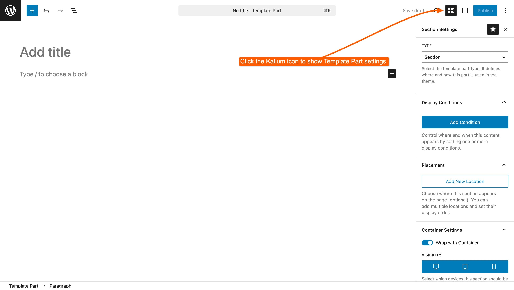

# Settings

Template Parts in Kalium have a dedicated settings panel that lets you control how and where your content appears on your site. Depending on the type of Template Part you're creating (Section, Header, Footer, Page, Popup, or Snippet), the available settings may vary.

In this article, we’ll walk through the main parts of this panel, including how to open it and switch between Template Part types.

***

## Settings Panel

To open the Template Part settings, click the **Kalium icon** in the top-right corner while editing a Template Part.

This will toggle the settings panel on the right side of the editor. From here, you can configure all available options for your Template Part.

<figure><figcaption></figcaption></figure>

***

### What's on the panel

**Type** comes first, and it decides everything below it. Change the Type and the panel rebuilds itself with the settings that apply.

| Type | Settings you'll see |
| --- | --- |
| **Section** | Display Conditions, Placement, Container Settings |
| **Header** | Display Conditions, Header Settings |
| **Footer** | Display Conditions, Footer Settings |
| **Page** | Display Conditions, Page Settings |
| **Popup** | Display Conditions, Popup Settings, Popup Triggers |
| **Snippet** | Snippet Type, Execution Scope, Execute Conditions, Placement, Snippet Settings |

Two settings are shared by everything, though they behave slightly differently:

**Display Conditions** decide **which pages** the part applies to. Every type has them, and **without at least one condition a part is never shown**, with one exception: on a Snippet they're called **Execute Conditions**, and an empty list there means *no restriction* rather than *never*.

**Placement** decides **where on the page** something goes. Only **Sections** and **Snippets** have it, the other types already know where they belong.


[type.md](type.md)



[display-conditions.md](display-conditions.md)



[placement.md](placement.md)



[container-settings.md](container-settings.md)


***


**A setting you expected isn't there?** Check the **Type** first, most of the panel changes with it. A Header part has no Placement, and a Section has no Header Settings.


