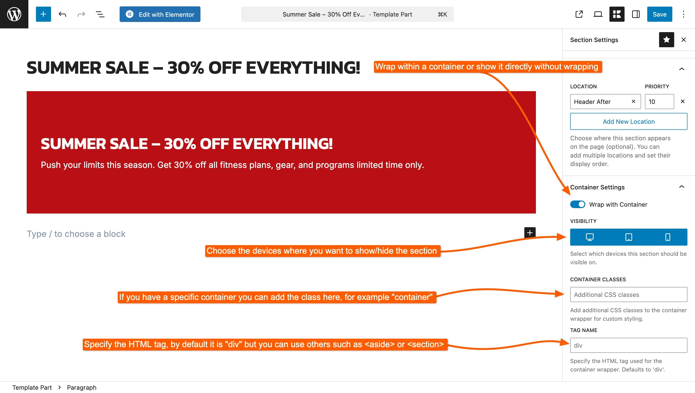
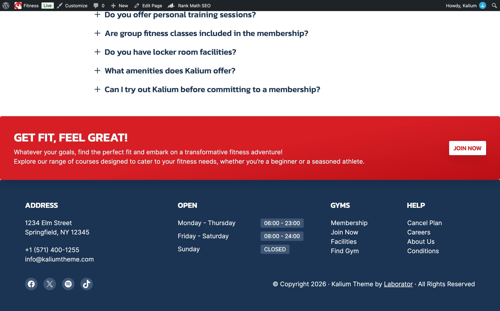
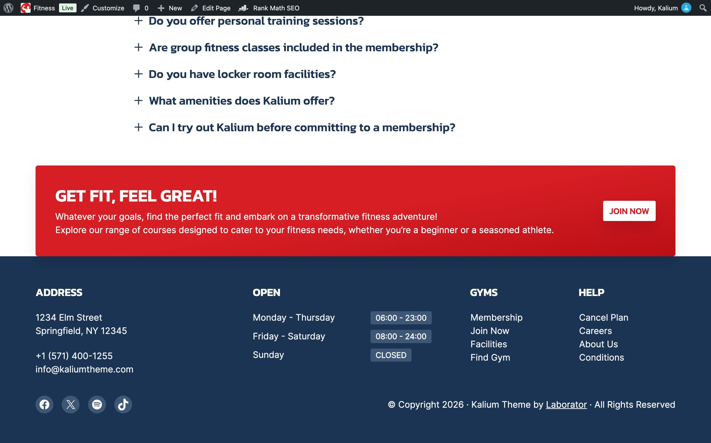

# Container Settings

**Container Settings** is specific to **Sections**. It controls the wrapper Kalium puts around your section, how wide it is, which devices see it, and what HTML element is used.

<figure><figcaption></figcaption></figure>

***

### Wrap with Container

This is the setting people come here for. It decides whether your section lines up with the rest of the page, or runs edge to edge.

**On**\
The section sits inside the site's content container, so its left and right edges line up with the header, the content and the footer. This is the default and it is what you want most of the time.

**Off**\
The section stretches the full width of the browser window. This is how you build a full-width colored band, a wide image strip, or a promotional bar that spans the whole screen.


**"My section isn't full width."** Turn **Wrap with Container** off. This is the single most common question about sections.

The reverse also happens: a section that looks like it is escaping the page layout usually needs this turned back on.


<figure><figcaption></figcaption></figure> <figure><figcaption></figcaption></figure>

***

### Visibility

Choose which devices show this section:

* **Desktop**
* **Tablet**
* **Mobile**

All three are on by default. Turn one off and the section is hidden on that device.

This is how you show a wide promotional banner on desktop but keep it off phones, where it would take up most of the screen. It is also the first thing to check when a section appears on your computer but not on your phone.

***

### Container Classes

Add your own CSS class names to the section wrapper, separated by spaces.

You only need this if you're writing custom CSS and want a reliable way to target this particular section. Leave it empty otherwise.

***

### Tag Name

The HTML element used for the wrapper. The default works for most sections.

If you know why you'd want a `<section>` or an `<aside>` instead of a `
`, this is where you change it. If that sentence didn't mean anything to you, leave it as it is. It makes no visual difference.

***

These settings are shown in context, as part of building a real section, here:


[creating-a-section](../creating-template-parts/creating-a-section/)

