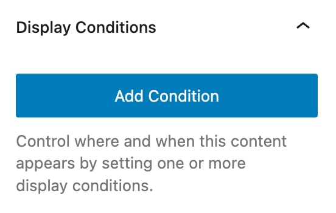
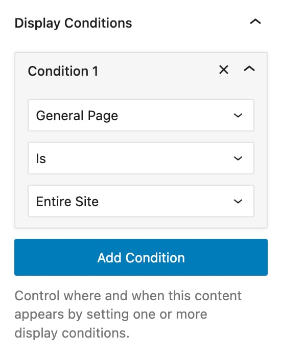
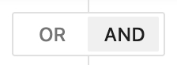

# Display Conditions

Display Conditions let you control **where** and **when** a Template Part appears on your site.

You can create rules to include or exclude specific areas based on page type, user role, WooCommerce state, date, and more, giving you full control over visibility without writing any code.

This works with every Template Part type: **Sections**, **Headers**, **Footers**, **Pages** and **Popups**. On a **Snippet** the same panel is called **Execute Conditions**, and it gates when the code runs.

***

### How to Add Conditions

While editing a Template Part:

1. Click the **Kalium icon** in the top-right corner to open the settings panel
2. Scroll to the **Display Conditions** section
3. Click **Add Condition**\
   
4. Choose a condition type (e.g. General Page, Single Post, etc.)\
   
5. Set the rule using **is** or **is not**
6. Select the target (e.g. a specific page, post type, or user role)

***

### Using “is” and “is not”

Most conditions offer two rule types:

* **Is** – The Template Part will be shown on the selected target(s)
* **Is Not** – The Template Part will be hidden on the selected target(s)

Some conditions offer more. Text-matching ones such as **URL Query String**, **Referrer URL** and **Meta** add **Starts With**, **Ends With**, **Matches Regex** and **Not Matches Regex**. **Specific Date** and **Specific Time** add **Before**, **After**, **On or Before** and **On or After**. Conditions that test for presence, such as **Featured Image**, read **Has** and **Has Not** instead.


Example:

* **is** → Show on the Front Page
* **is not** → Show everywhere **except** the Front Page


***

### Condition Types

Here’s a full list of supported condition types, grouped for clarity. These allow you to target content by page, post, user status, taxonomy, time, and more.

| **General Page** | **Where it applies**                |
| ---------------- | ----------------------------------- |
| Entire Site      | Applies to every page on your site  |
| Front Page       | The homepage of your WordPress site |
| Blog Page        | The main blog listing page          |
| 404 Error Page   | The "Page Not Found" screen         |
| Search Page      | Search results pages                |
| Maintenance Mode Page | The maintenance page, when that mode is on |

| **Singular Content**    | **Where it applies**                                                              |
| ----------------------- | --------------------------------------------------------------------------------- |
| Single Post             | Individual blog posts                                                             |
| Single Page             | Individual static pages                                                           |
| Custom Post Type Single | Select any custom post type (e.g. Portfolio, Product), then choose specific items |
| Attachment              | Media attachment pages                                                            |

| **Archive**              | **Where it applies**                                           |
| ------------------------ | -------------------------------------------------------------- |
| Blog Archive             | The main post archive                                          |
| Date Archive             | Archives by day, month, or year                                |
| Author Archive           | Pages listing posts by a specific author                       |
| Custom Post Type Archive | Archive page for custom post types (e.g. Products, Portfolios) |

| **Taxonomy**            | **Where it applies**                                                        |
| ----------------------- | --------------------------------------------------------------------------- |
| Category Archive        | Blog categories (e.g. News, Tutorials)                                      |
| Tag Archive             | Blog tags                                                                   |
| Custom Taxonomy Archive | Choose custom taxonomy and terms (e.g. Product Categories, Portfolio Types) |

| **Current Post**  | **Where it applies**                                             |
| ----------------- | ---------------------------------------------------------------- |
| Featured Image    | Whether the current item has one                                  |
| Type              | The post type of the current item                                 |
| Meta              | A meta key and value on the current item                          |
| ID                | A specific post ID                                                |
| Format            | The post format                                                   |
| Status            | The post status                                                   |
| Author            | The item's author                                                 |
| Term              | A taxonomy term on the current item                               |
| Sticky            | Whether the post is sticky                                        |

| **User**   | **Where it applies**                                                         |
| ---------- | ---------------------------------------------------------------------------- |
| Logged In  | Shows only to users who are logged in                                        |
| Logged Out | Shows only to users who are not logged in                                    |
| User Role  | Target specific roles like Administrator, Editor, Subscriber, Customer, etc. |

| **WooCommerce**          | **Where it applies**                        |
| ------------------------ | ------------------------------------------- |
| Product Page             | Individual product pages                    |
| Shop Archive             | The main shop page                          |
| Product Category Archive | Category listings (e.g. T-Shirts, Shoes)    |
| Product Tag Archive      | Tag listings on products                    |
| Cart Page                | The WooCommerce cart page                   |
| Checkout Page            | The WooCommerce checkout                    |
| My Account Page          | Customer account area (login, orders, etc.) |


WooCommerce-specific conditions only appear if WooCommerce is active on your site.


| **Date & Time** | **Where it applies**                                |
| --------------- | --------------------------------------------------- |
| Specific Date   | Show only on a selected date                        |
| Specific Time   | Show only during a specific time of day             |
| Specific Days   | Show only on selected weekdays (e.g. weekends only) |

| **Custom Condition** | **Where it applies**                                                      |
| -------------------- | ------------------------------------------------------------------------- |
| PHP Callback         | Enter a custom PHP function that returns true/false                       |
| URL Query String     | Match parts of the URL (e.g. `?utm_campaign=summer`)                      |
| Referrer URL         | Show based on the referring page or site                                  |

***

### Logical Operators: AND / OR

Every condition after the first carries its own **OR** / **AND** toggle, shown just above it. **OR** is the default.

<figure><figcaption></figcaption></figure>

These are called **logical operators**, and they control how that condition joins the one before it:

* **AND** – This condition and the one above it must both match\
  _&#x45;xample: Show only on the Cart page **AND** only for logged-in users_
* **OR** – This condition starts a fresh alternative, and the part appears if any alternative matches\
  _&#x45;xample: Show on the Front Page **OR** the Blog page_

Because the toggle is per condition, you can mix them. A run of conditions joined by **AND** has to match as a whole, and an **OR** begins the next run. Four conditions joined AND, OR, AND read as "(1 and 2) or (3 and 4)".

***

Display Conditions are one of the most powerful features in Template Parts. Combined with Placement and Container Settings, they give you full control over when and where your content appears, without any custom code.
