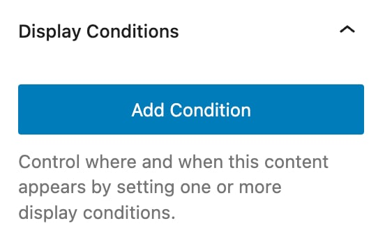

# Display Conditions

Display Conditions let you control **where** and **when** a Template Part appears on your site.

You can create rules to include or exclude specific areas based on page type, user role, WooCommerce state, date, and more — giving you full control over visibility without writing any code.

This works with all Template Part types: **Sections**, **Headers**, **Footers**, and **Pages**.

***

### How to Add Conditions

While editing a Template Part:

1. Click the **Kalium icon** in the top-right corner to open the settings panel
2. Scroll to the **Display Conditions** section
3. Click **Add Condition**\
   
4. Choose a condition type (e.g. General Page, Single Post, etc.)\
   
5. Set the rule using **is** or **is not**
6. Select the target (e.g. a specific page, post type, or user role)

***

### Using “is” and “is not”

Each condition supports two rule types:

* **is** – The Template Part will be shown on the selected target(s)
* **is not** – The Template Part will be hidden on the selected target(s)


Example:

* **is** → Show on the Front Page
* **is not** → Show everywhere **except** the Front Page


***

### Condition Types

Here’s a full list of supported condition types, grouped for clarity. These allow you to target content by page, post, user status, device type, time, and more.

| **General Page** | **Where it applies**                |
| ---------------- | ----------------------------------- |
| Entire Site      | Applies to every page on your site  |
| Front Page       | The homepage of your WordPress site |
| Blog Page        | The main blog listing page          |
| 404 Error Page   | The "Page Not Found" screen         |
| Search Page      | Search results pages                |

| **Singular Content**    | **Where it applies**                                                              |
| ----------------------- | --------------------------------------------------------------------------------- |
| Single Post             | Individual blog posts                                                             |
| Single Page             | Individual static pages                                                           |
| Custom Post Type Single | Select any custom post type (e.g. Portfolio, Product), then choose specific items |
| Attachment              | Media attachment pages                                                            |

| **Archive**              | **Where it applies**                                           |
| ------------------------ | -------------------------------------------------------------- |
| Blog Archive             | The main post archive                                          |
| Date Archive             | Archives by day, month, or year                                |
| Author Archive           | Pages listing posts by a specific author                       |
| Custom Post Type Archive | Archive page for custom post types (e.g. Products, Portfolios) |

| **Taxonomy**            | **Where it applies**                                                        |
| ----------------------- | --------------------------------------------------------------------------- |
| Category Archive        | Blog categories (e.g. News, Tutorials)                                      |
| Tag Archive             | Blog tags                                                                   |
| Custom Taxonomy Archive | Choose custom taxonomy and terms (e.g. Product Categories, Portfolio Types) |

| **User**   | **Where it applies**                                                         |
| ---------- | ---------------------------------------------------------------------------- |
| Logged In  | Shows only to users who are logged in                                        |
| Logged Out | Shows only to users who are not logged in                                    |
| User Role  | Target specific roles like Administrator, Editor, Subscriber, Customer, etc. |

| **WooCommerce**          | **Where it applies**                        |
| ------------------------ | ------------------------------------------- |
| Product Page             | Individual product pages                    |
| Shop Archive             | The main shop page                          |
| Product Category Archive | Category listings (e.g. T-Shirts, Shoes)    |
| Product Tag Archive      | Tag listings on products                    |
| Cart Page                | The WooCommerce cart page                   |
| Checkout Page            | The WooCommerce checkout                    |
| My Account Page          | Customer account area (login, orders, etc.) |


WooCommerce-specific conditions only appear if WooCommerce is active on your site.


| **Date & Time** | **Where it applies**                                |
| --------------- | --------------------------------------------------- |
| Specific Date   | Show only on a selected date                        |
| Specific Time   | Show only during a specific time of day             |
| Specific Days   | Show only on selected weekdays (e.g. weekends only) |

| **Custom Condition** | **Where it applies**                                                      |
| -------------------- | ------------------------------------------------------------------------- |
| PHP Callback         | Enter a custom PHP function that returns true/false                       |
| Post Meta            | Target based on a meta key/value with operators (e.g. `meta_key = value`) |
| URL Query String     | Match parts of the URL (e.g. `?utm_campaign=summer`)                      |
| Referrer URL         | Show based on the referring page or site                                  |

***

### Logical Operators: AND / OR

When adding more than one condition, you'll see a toggle at the top of the conditions panel to choose between **AND** and **OR**.

<figure><figcaption></figcaption></figure>

These are called **logical operators**, and they control how the conditions work together:

* **AND** – All conditions must match for the Template Part to appear\
  &#xNAN;_&#x45;xample: Show only on the Cart page **AND** only for logged-in users_
* **OR** – The Template Part appears if **any** of the conditions match\
  &#xNAN;_&#x45;xample: Show on the Front Page **OR** the Blog page_

You can switch between these modes at any time to change how your display rules are applied.

***

Display Conditions are one of the most powerful features in Template Parts. Combined with Placement and Container Settings, they give you full control over when and where your content appears — without any custom code.
