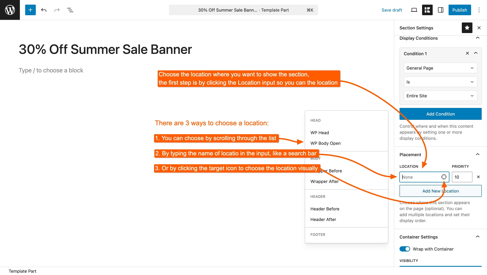
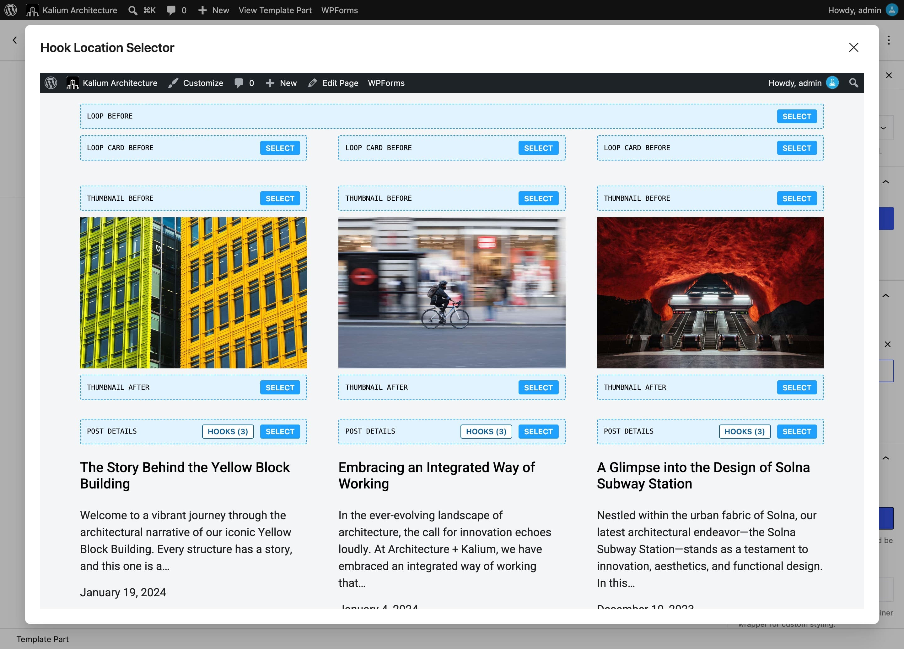

# Placement

**Display Conditions decide&#x20;**_**which pages**_**&#x20;a Template Part applies to. Placement decides&#x20;**_**where on those pages**_**&#x20;it goes.** You normally set both.

Placement is available for **Sections** and **Snippets** only. The other types already know where they belong (a Header replaces the header, a Page replaces the page) so they have no Placement setting at all.

<figure><figcaption></figcaption></figure>

***

### Choosing a location

Click **Open hook location selector** to browse the available spots. There are **104 of them, arranged in 20 groups**, so browsing beats guessing.

Locations are named for where they sit, and the names follow a pattern once you've seen a few: **Header After** is just below the header, **Loop Card Before** is above each card in a listing, **Post Content Before** is above the text of a single post.

<figure><figcaption></figcaption></figure>

| Group                        | Where it covers                                                      |
| ---------------------------- | -------------------------------------------------------------------- |
| **Head**                     | The document head, and the point where styles and scripts are queued |
| **Body**                     | Just inside and around the page wrapper                              |
| **Header**                   | Before, after, inside the start and end of the header                |
| **Footer**                   | The same four spots around the footer                                |
| **Content**                  | Directly before and after the main content                           |
| **Loop**                     | Around a listing, and around each card inside one                    |
| **Sidebar**                  | Before and after the widget column                                   |
| **Blog - Archive**           | The blog listing and the parts of each card                          |
| **Blog - Single**            | A single post, its featured image, header, content and footer        |
| **Portfolio - General**      | Portfolio listings and the lightbox                                  |
| **Portfolio - Single**       | A single project, its content and gallery                            |
| **Comments**                 | Around the comment area                                              |
| **Search Page**              | The search results page                                              |
| **WooCommerce - General**    | Shop-wide spots                                                      |
| **WooCommerce - Archive**    | The shop and category listings                                       |
| **WooCommerce - Single**     | The product page                                                     |
| **WooCommerce - Cart**       | The cart page                                                        |
| **WooCommerce - Checkout**   | The checkout page                                                    |
| **WooCommerce - My Account** | The account pages                                                    |
| **Other**                    | Everything that does not fit the groups above                        |


Not sure which location is which? Kalium can show you. Open any page on your site while logged in and use the **hook viewer** to see the locations highlighted in place on the real page, far quicker than trial and error.



***

### Priority

Each placement has a **Priority** next to it. It only matters when more than one thing is attached to the same location.

**Lower numbers run first.** The default is 10. If your section needs to appear above another section already at that spot, set it to 5. To push it below, set it to 20.

Most of the time you can leave this alone.

***

### More than one placement

You can add several placements to a single Template Part, and it will appear at each one. This is useful for something like a promotional bar that belongs both after the header and above the checkout button, one part, two placements, edited in one place.

***

### Custom hook names

If none of the 104 locations is right, choose **Enter custom hook name** and type any WordPress action hook. Plugins add their own hooks, so this is how a Section is placed inside a plugin's output.

This is the one part of Placement that assumes some technical knowledge. If you're not sure what a hook name is, the location selector almost certainly has what you need.

***

### Placement for Snippets

For a Snippet, Placement answers _when the code runs_ rather than where content appears. The rules are different enough to be worth stating plainly:

* **CSS and JavaScript snippets need a placement.** Without one they do not run at all. New CSS and JavaScript snippets are given **Enqueue Scripts** automatically, which is almost always the right answer.
* **PHP snippets usually should not have one.** Left with no placement, a PHP snippet runs as the theme loads, early enough to add hooks, filters and shortcodes. Give it a placement only when the code needs to output something at a specific spot on the page.


[code-snippets](../creating-template-parts/code-snippets/)


***

### When a Section appears in the wrong place

**It's at the top or bottom of the page instead of where you chose.** Check the location group matches the page type, a **Blog - Single** location does nothing on a product page.

**It shows above something it should be below.** Raise the Priority number.

**Nothing appears at all.** Placement decides _where_, conditions decide _whether_. A Section with a placement but no display conditions is never shown on any page.

Placements are chosen and explained in context in the section walkthrough:


[creating-a-section](../creating-template-parts/creating-a-section/)

