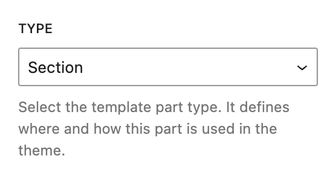

# Type

At the top of the panel, you'll see the **Type** dropdown. This defines the kind of Template Part you're working on, and it is the most important setting on the panel: **it decides which other settings appear below it.**

* **Section** – Used to inject content into hook locations across the site.
* **Header** – Replaces the default site header.
* **Footer** – Replaces the default footer.
* **Page** – Replaces entire pages like 404, search results, or archives.
* **Popup** – Opens over the page when a trigger you choose fires.
* **Snippet** – Runs a piece of PHP, CSS or JavaScript instead of showing content.

<figure><figcaption></figcaption></figure>


Creating a Template Part from one of the tabs at the top of the **Kalium -> Template Parts** screen sets the Type for you. Starting from the **Footers** tab creates a Footer, and so on.


***

### Adding to a page, or replacing part of it

The six types divide into two groups, and knowing which is which saves a lot of confusion later.

**Sections and Popups add to a page.** The page renders as normal and your content is placed into it, a banner after the header, a notice above the checkout button, a popup over the top. Nothing is taken away.

**Headers, Footers and Pages replace.** Where one of these applies, it takes the place of what was there. A Header template part replaces the header from **Appearance -> Customize -> Header** on the pages it matches, and the Customizer settings no longer apply there.

**Snippets do neither**\
They run code rather than showing content.

***

### What changes when you switch Type

| Type | Settings that appear |
| --- | --- |
| **Section** | Display Conditions, Placement, Container Settings |
| **Header** | Display Conditions, Header Settings |
| **Footer** | Display Conditions, Footer Settings |
| **Page** | Display Conditions, Page Settings |
| **Popup** | Display Conditions, Popup Settings, Popup Triggers |
| **Snippet** | Snippet Type, Execution Scope, Execute Conditions, Placement, Snippet Settings |

**Placement** (the setting that says where on the page something goes) only exists for **Sections** and **Snippets**. The other types already know where they belong: a Header goes where the header goes.

***

### Changing the Type later

You can change the Type at any time, and the settings below update immediately. Your content is kept.

The one exception is **Snippet**. Because a Snippet holds a single locked code block rather than normal content, switching a part to or from Snippet asks you to confirm first, the content is replaced, not converted.


Changing Type can make a part stop appearing. A part that worked as a Section may show nothing as a Page until you set a condition that matches a real page. If something disappears after a Type change, the conditions are the first place to look.


***

### Where each type is covered


[creating-a-section](../creating-template-parts/creating-a-section/)



[replace-the-header.md](../creating-template-parts/replace-the-header.md)



[replace-the-footer.md](../creating-template-parts/replace-the-footer.md)



[replace-a-page.md](../creating-template-parts/replace-a-page.md)



[popups.md](../creating-template-parts/popups.md)



[code-snippets](../creating-template-parts/code-snippets/)

