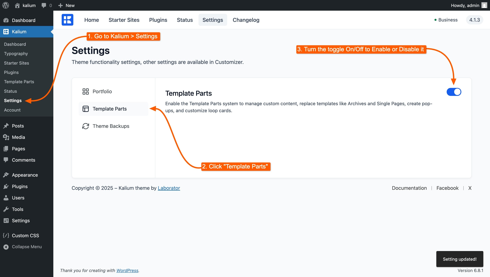

# What are Template Parts?



Ever wanted to show a special section only on product pages? Or maybe use a different footer during a sale? Even replace the default 404 page with something more helpful or on-brand? That’s what Template Parts are for.

They let you display custom content in specific areas of your site, exactly where and when you want. No coding needed, and you can build everything using the page builder you're already comfortable with: Gutenberg, Elementor, or WPBakery.

Here are some examples of Template Parts and how they can help:

* Show a banner during a holiday sale
* Use a simpler footer on checkout and thank-you pages
* Display a different header when users are logged in
* Customize your blog category layout with a unique design
* Add a call-to-action after product descriptions
* Replace the default 404 page with something more useful
* Open a newsletter popup when someone is about to leave
* Add custom PHP, CSS or JavaScript without touching a theme file
* ...and many other possibilities

Template Parts are flexible, reusable, and give you a powerful way to personalize your site.

***

### The six types

| Type | What it does |
| --- | --- |
| **Section** | Places a block of content at a chosen spot on other pages |
| **Header** | Replaces the site header |
| **Footer** | Replaces the site footer |
| **Page** | Replaces an entire page's content |
| **Popup** | Opens over the page when a trigger fires |
| **Snippet** | Runs a piece of PHP, CSS or JavaScript |

The first five are about **content**. The sixth, **Snippet**, is about **code**. It's Kalium's replacement for the old advice to "add this to your functions.php file".


[code-snippets](creating-template-parts/code-snippets/)



**Sections and Popups add to a page. Headers, Footers and Pages replace part of it.** That distinction explains most surprises, if your Customizer header settings suddenly stop applying on some pages, a Header template part is very likely matching them.


***

### Enabling Template Parts

Template Parts are enabled by default when you install Kalium. If you ever need to turn them off or back on:

1. Go to **Kalium -> Settings** in your WordPress admin.
2. On the left sidebar, click **Template Parts**.
3. Use the toggle switch to enable or disable the feature.

This gives you the flexibility to turn the feature off if you're not using it, and re-enable it later when needed.

<figure><figcaption></figcaption></figure>
