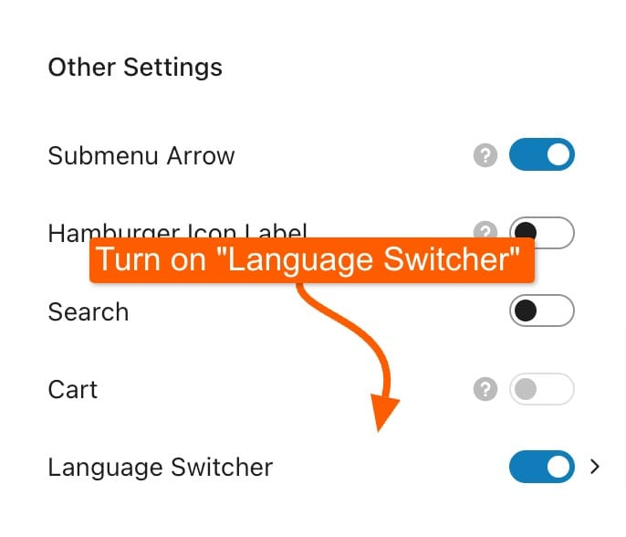
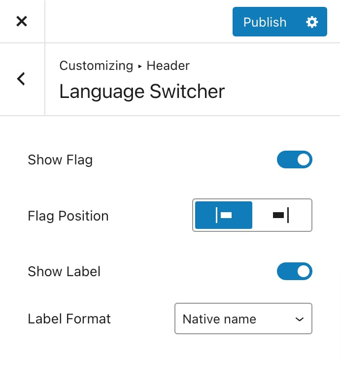

# Adding a Language Switcher

Kalium supports multilingual websites through WPML, allowing you to add a language switcher in various locations. This guide covers how to add a language switcher in Kalium using WPML through three methods: Header, Widget, and Shortcode.

### Adding a Language Switcher in the Header

Kalium makes it easy to integrate a language switcher into your site's header. Follow these steps to enable the language switcher in the header:

#### Enable the Language Switcher in the Header:

1. Go to **Appearance -> Customize**.
2. Navigate to **Header -> Other Settings**.
3. Find the "**Language Switcher**" option and toggle it on.

<figure><figcaption></figcaption></figure>

### Language Switcher Options

Once you’ve enabled the language switcher, you can adjust its appearance and functionality to fit your site’s design.

<figure><figcaption></figcaption></figure>

**Show Flag:**

Choose whether to display flags for each language. Enable this option to show flags or disable it if you prefer not to use them.

**Flag Position:**

Select the position of the flags relative to the language names. You can choose to display flags on the left or right side of the language names.

**Show Label:**

Decide whether to display language names alongside the flags. Toggle this option to show or hide labels for the languages.

**Label Format:**

Choose how language names are displayed:

* **Native Name:** Displays the language name in its native script (e.g., "Français").
* **Translated Name:** Displays the language name in the language of the site (e.g., "French").
* **Initials:** Shows language initials (e.g., "EN" for English).
* **Native Name (Translated Name):** Displays the language name in its native script followed by the translated name (e.g., "Français (French)").
* **Translated Name (Native Name):** Displays the translated name followed by the native name (e.g., "French (Français)").

#### Using a Custom Header:

If you are using a custom header, you'll need to manually add the language switcher element.

Please check the [custom header](../general/header/custom-header/) article on setting on adding elements to your custom header and also the language switcher element article to see the available options:

[#language-switcher](../general/header/custom-header/elements.md#language-switcher "mention")

### Adding a Language Switcher via Widget

To add a language switcher using a widget:

1. Navigate to **Appearance -> Widgets** in your WordPress admin panel.
2. Find the "**WPML Language Switcher**" widget in the list of available widgets and drag and drop the widget into your desired widget area (e.g., Sidebar, Footer).
3. Customize the widget settings as needed, including options for display style and language selection.

### Adding a Language Switcher via Shortcode

WPML also provides a shortcode to insert a language switcher into posts, pages, or any content area, add the following shortcode where you want the language switcher to appear:

```
[wpml_language_switcher]
```

You can customize the shortcode by following [WPML's documentation](https://wpml.org/documentation/getting-started-guide/language-setup/language-switcher-options/adding-language-switchers-using-php-and-shortcodes/) for additional parameters and options. Edit the page or post where you want to add the language switcher and paste the shortcode to add it there.
