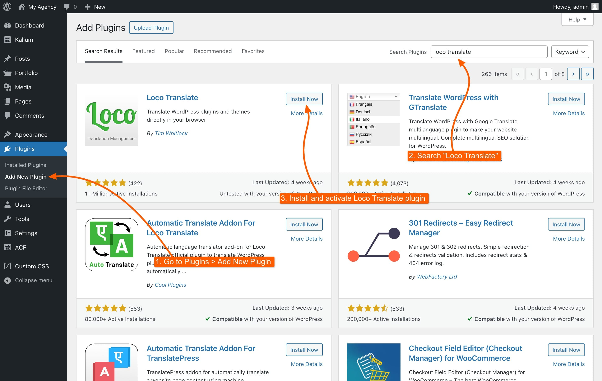

# Translating with Loco Translate

Loco Translate is a popular WordPress plugin that simplifies the process of translating themes and plugins, making it an excellent choice for translating Kalium. With Loco Translate, you can easily manage translation files directly from your WordPress dashboard without needing any external software.



### Why Use Loco Translate?

Kalium is designed to be used globally, but not every language is pre-translated in the theme. If your language isn't already included or you want to customize certain text strings, Loco Translate provides an intuitive way to create and manage these translations.

### Installing Loco Translate

<figure><figcaption></figcaption></figure>

To get started, you'll first need to install the Loco Translate plugin:

1. Navigate to **Plugins** **->** **Add New** in your WordPress dashboard.
2. Search for **Loco Translate**.
3. Click **Install Now**, then **Activate** the plugin.

Once installed, Loco Translate will appear in your WordPress dashboard menu.

### Translating Kalium Strings

1. Go to **Loco Translate** **->** **Themes**.
2. Select **Kalium** from the list of themes.
3. If your desired language is not listed, click on **New Language**.
   * Choose the language you want to translate Kalium into.
   * Select the **location** where the translation file will be saved.
   * Click **Start Translating**.
4. You’ll see a list of text strings used in Kalium. Click on any string to translate it.
   * Enter the translation in the text box below.
   * Save your progress frequently by clicking the **Save** button.

### Saving and Applying Translations

Once you’ve finished translating:

1. Click the **Save** button to store your translations.
2. Loco Translate will automatically generate and save the necessary `.po` and `.mo` files needed to display your translations on the site.

### Updating Translations

If you update Kalium or any of its plugins, some new strings may need translation. You can easily update your translations by following these steps:

1. Go to **Loco Translate** **->** **Themes**.
2. Select **Kalium**.
3. Choose the language you've been working on.
4. Click **Sync** to pull in any new strings that require translation.
5. Translate the new strings and save your work.

### Managing and Exporting Translation Files

If you want to share your translations or move them to another site:

1. Go to **Loco Translate** **->** **Themes**.
2. Select **Kalium**.
3. Choose the language you've been working on.
4. On the top right area click on the :arrow\_down: **PO** or **ZIP** button to download the files.
