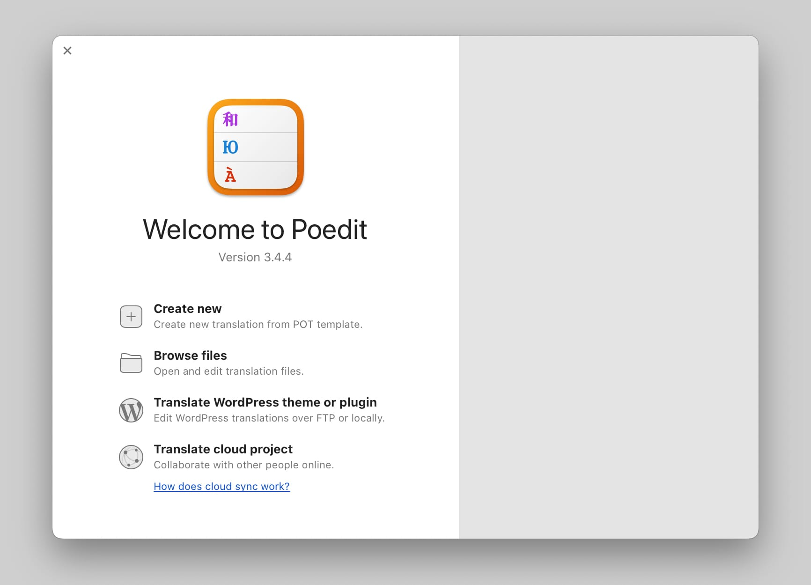

# Translating with Poedit

If your language is not included in Kalium's pre-translated languages, or if you want to modify existing translations, you can easily do so by creating or editing a **.po** file. The process involves translating text strings and saving the translations so that WordPress can read them. Whether you're starting a new translation from scratch or just editing existing translations, the steps are straightforward.

You don’t have to translate every string; you can choose which parts of Kalium to translate, making this method flexible and tailored to your needs.



<figure><figcaption></figcaption></figure>


Although Poedit is a viable method for translation, [using Loco Translate](translating-with-loco-translate.md) is generally recommended as it offers a more user-friendly and integrated approach for translating and managing theme strings directly within your WordPress dashboard.


### Starting a New Translation

1. Download and install Poedit, a free software available for Windows, macOS, and Linux.
2. Open Poedit and select **Create new**
3. Navigate to the **kalium.pot** file located in the Kalium folder **kalium -> languages** folder. Select the file to load all English text strings into Poedit.
4. In the left column, you'll see the original English text (Source Text). To translate, select a line, and in the lower right section of the window, enter your translation in the **Translation** field.
5. Once you've translated all necessary strings, save the file with the format `kalium-[language_code].po` (e.g., `kalium-de_DE.po` for German, find the full list of language codes [below](translating-with-poedit.md#wordpress-locale-codes)) Poedit will automatically create the corresponding **.mo** file.
6. Upload the **.po** and **.mo** files to the `wp-content/languages/themes` directory on your WordPress site.

### Editing an Existing Translation

1. Open Poedit and click **Browse files** button
2. Use the search function (`CMD+F` on macOS or `CTRL+F` on Windows) to find the string you want to edit.
3. In the **Translation** field, replace the current translation with your preferred text.
4. Save the file, and Poedit will update the **.po** and **.mo** file automatically.
5. Upload the **.po** and **.mo** files to the `wp-content/languages/themes` directory on your WordPress site.

### WordPress Locale Codes

Below is a list of WordPress locale codes that you can use when naming your translation files.

| Locale Name            | Native Name            | Locale Code  | WordPress Locale |
| ---------------------- | ---------------------- | ------------ | ---------------- |
| Afrikaans              | Afrikaans              | af           | af               |
| Albanian               | Shqip                  | sq           | sq               |
| Algerian Arabic        | الدارجة الجزايرية      | arq          | arq              |
| Amharic                | አማርኛ                   | am           | am               |
| Arabic                 | العربية                | ar           | ar               |
| Armenian               | Հայերեն                | hy           | hy               |
| Aromanian              | Armãneashce            | rup          | rup\_MK          |
| Arpitan                | Arpitan                | frp          | frp              |
| Assamese               | অসমীয়া                | as           | as               |
| Asturian               | Asturianu              | ast          | ast              |
| Azerbaijani            | Azərbaycan dili        | az           | az               |
| Azerbaijani (Turkey)   | Azərbaycan Türkcəsi    | az-tr        | az\_TR           |
| Balochi Southern       | بلوچی مکرانی           | bcc          | bcc              |
| Bashkir                | башҡорт теле           | ba           | ba               |
| Basque                 | Euskara                | eu           | eu               |
| Belarusian             | Беларуская мова        | bel          | bel              |
| Bengali                | বাংলা                  | bn           | bn\_BD           |
| Bengali (India)        | বাংলা (ভারত)           | bn-in        | bn\_IN           |
| Bhojpuri               | भोजपुर                 | bho          | bho              |
| Bodo                   | बोडो                   | brx          | brx              |
| Borana-Arsi-Guji Oromo | Afaan Oromoo           | gax          | gax              |
| Bosnian                | Bosanski               | bs           | bs\_BA           |
| Breton                 | Brezhoneg              | br           | bre              |
| Bulgarian              | Български              | bg           | bg\_BG           |
| Catalan                | Català                 | ca           | ca               |
| Catalan (Balear)       | Català (Balear)        | bal          | bal              |
| Cebuano                | Cebuano                | ceb          | ceb              |
| Chinese (China)        | 简体中文                   | zh-cn        | zh\_CN           |
| Chinese (Hong Kong)    | 香港中文版                  | zh-hk        | zh\_HK           |
| Chinese (Singapore)    | 中文                     | zh-sg        | zh\_SG           |
| Chinese (Taiwan)       | 繁體中文                   | zh-tw        | zh\_TW           |
| Cornish                | Kernewek               | cor          | cor              |
| Corsican               | Corsu                  | co           | co               |
| Croatian               | Hrvatski               | hr           | hr               |
| Czech                  | Čeština‎               | cs           | cs\_CZ           |
| Danish                 | Dansk                  | da           | da\_DK           |
| Dhivehi                | ދިވެހި                 | dv           | dv               |
| Dutch                  | Nederlands             | nl           | nl\_NL           |
| Dutch (Belgium)        | Nederlands (België)    | nl-be        | nl\_BE           |
| Dzongkha               | རྫོང་ཁ                 | dzo          | dzo              |
| Emoji                  | 🌏🌍🌎 (Emoji)         | art-xemoji   | art\_xemoji      |
| English (Australia)    | English (Australia)    | en-au        | en\_AU           |
| English (Canada)       | English (Canada)       | en-ca        | en\_CA           |
| English (New Zealand)  | English (New Zealand)  | en-nz        | en\_NZ           |
| English (Pirate)       | English (Pirate)       | art\_xpirate | art\_xpirate     |
| English (South Africa) | English (South Africa) | en-sa        | en\_SA           |
| English (UK)           | English (UK)           | en-gb        | en\_GB           |
| Esperanto              | Esperanto              | eo           | eo               |
| Estonian               | Eesti                  | et           | et               |
| Ewe                    | Eʋegbe                 | ewe          | ewe              |
| Faroese                | Føroyskt               | fo           | fo               |
| Finnish                | Suomi                  | fi           | fi               |
| Fon                    | fɔ̀ngbè                | fon          | fon              |
| French (Belgium)       | Français de Belgique   | fr-be        | fr\_BE           |
| French (Canada)        | Français du Canada     | fr-ca        | fr\_CA           |
| French (France)        | Français               | fr           | fr\_FR           |
| Frisian                | Frysk                  | fy           | fy               |
| Friulian               | Friulian               | fur          | fur              |
| Fulah                  | Pulaar                 | fuc          | fuc              |
| Galician               | Galego                 | gl           | gl\_ES           |
| Georgian               | ქართული                | ka           | ka\_GE           |
| German                 | Deutsch                | de           | de\_DE           |
| German (Austria)       | Deutsch (Österreich)   | de-AT        | de\_AT           |
| German (Switzerland)   | Deutsch (Schweiz)      | de-ch        | de\_CH           |
| Greek                  | Ελληνικά               | el           | el               |
| Greenlandic            | Kalaallisut            | kal          | kal              |
| Gujarati               | ગુજરાતી                | gu           | gu               |
| Haitian Creole         | Kreyol ayisyen         | hat          | hat              |
| Hausa                  | Harshen Hausa          | hau          | hau              |
| Hawaiian               | Ōlelo Hawaiʻi          | haw          | haw\_US          |
| Hazaragi               | هزاره گی               | haz          | haz              |
| Hebrew                 | עִבְרִית               | he           | he\_IL           |
| Hindi                  | हिन्दी                 | hi           | hi\_IN           |
| Hungarian              | Magyar                 | hu           | hu\_HU           |
| Icelandic              | Íslenska               | is           | is\_IS           |
| Ido                    | Ido                    | ido          | ido              |
| Igbo                   | Asụsụ Igbo             | ibo          | ibo              |
| Indonesian             | Bahasa Indonesia       | id           | id\_ID           |
| Irish                  | Gaeilge                | ga           | ga               |
| Italian                | Italiano               | it           | it\_IT           |
| Japanese               | 日本語                    | ja           | ja               |
