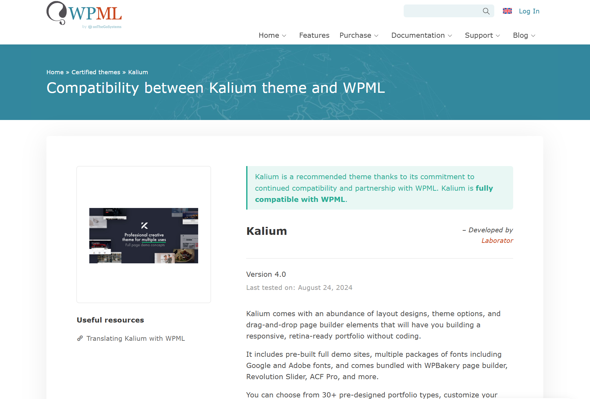
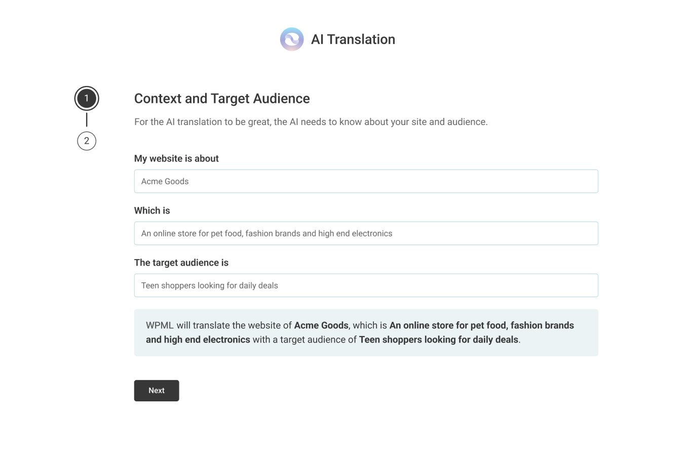
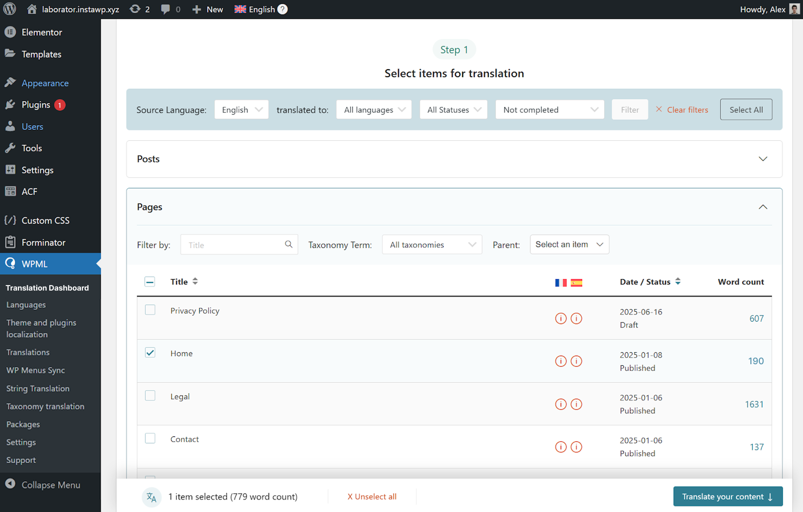
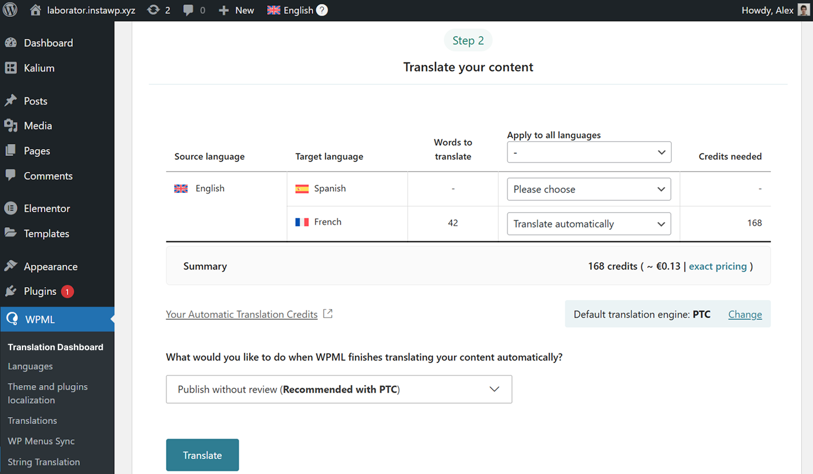
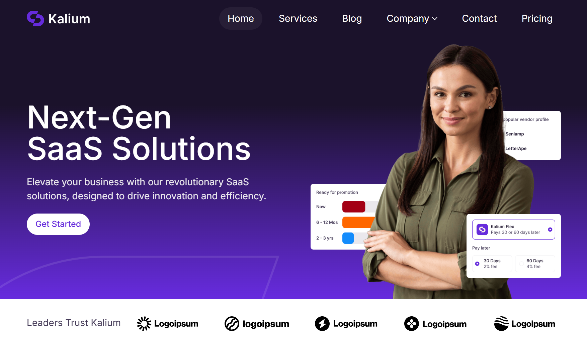
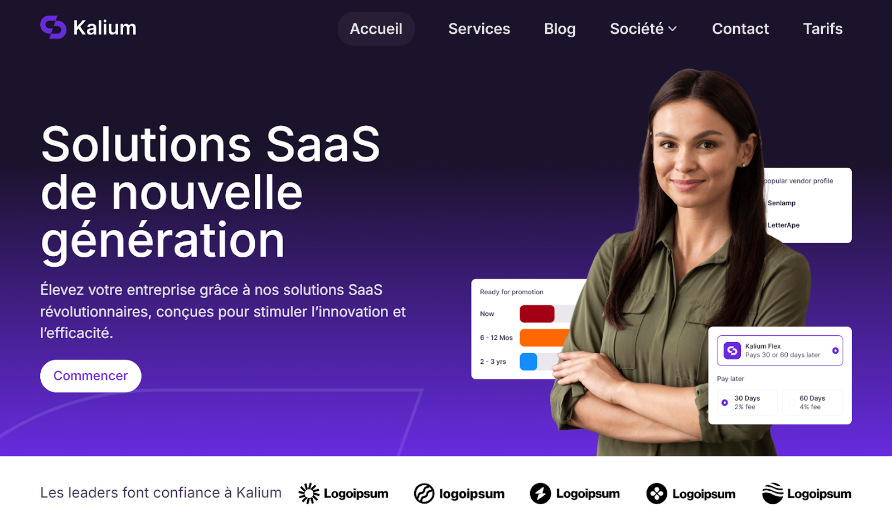
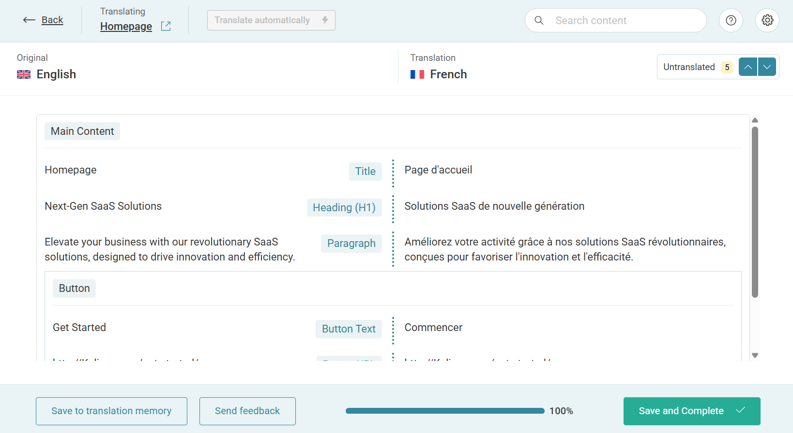
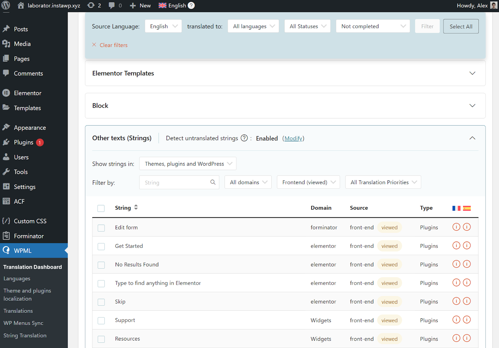

# Translating with WPML

[WPML](https://wpml.org) is the de-facto standard for multilingual WordPress, and is fully compatible with Kalium. WPML will provide [AI translations](https://wpml.org/documentation/automatic-translation/) for your content, which are typically **better than human translation**. You can edit and translate yourself if you prefer or use translation agencies.

Kalium is a certified theme by WPML, so translating your website is easy and straightforward.

<figure><figcaption></figcaption></figure>

### **Getting started**

If you don’t yet have a WPML account, [buy](https://wpml.org/purchase/) either the Multilingual CMS (for 3 sites) or Multilingual Agency (unlimited sites).

#### **Configuring WPML**

Once WPML is installed on your website, go to **WPML** → **Setup Wizard** to configure the plugin on your site. This includes choosing the languages you want to translate into, selecting a URL format for translated content, and providing context about your site.

<figure><figcaption></figcaption></figure>

Using the context that you provide, [PTC (Private Translation Cloud)](https://ptc.wpml.org/about/) – the most accurate automatic translation in WPML, will produce translations that fit your target audience and industry.

PTC is like your own team of expert translators with a deep understanding of your content and niche. It’s WPML’s proprietary AI technology, and even includes a translation quality guarantee: If you’re not satisfied with PTC’s translations, you’ll get a full refund.

Once you complete the setup wizard, you’re ready to start translating your website.

#### **Translating your website content**

To translate any content on your website with PTC, start by going to **WPML** → **Translation Dashboard**. This will open a dashboard with all your website content organized into sections, including:

* Pages and posts
* Custom posts
* Portfolio pages
* Page builder widgets (Elementor, WPBakery, etc.)
* WooCommerce products
* Menus
* And more…

To automatically translate your content with PTC, simply select all the items you want to translate.

<figure><figcaption></figcaption></figure>

Next, choose **Translate automatically** as your translation method, and click **Translate**. If you look under the table, WPML also shows you how much translating your content costs.

<figure><figcaption></figcaption></figure>

Once WPML finishes translating your content, your translations will appear on your website when switching languages. For example, here’s the homepage in English:

<figure><figcaption></figcaption></figure>

And here it is in French:

<figure><figcaption></figcaption></figure>

If you want to provide a fully localized experience, you can also use the [WPML Media Translation](https://wpml.org/documentation/getting-started-guide/media-translation/) add-on to include different images in each language. This is useful when your images include text (like in our example) and you want to show translated versions in each language.

While WPML’s automatic translations are highly accurate, you can always edit them using the **Advanced Translation Editor** if you want.

<figure><figcaption></figcaption></figure>

Simply go to the **Translation Dashboard**, select the content you want to edit, and choose **Translate myself** in **Step 2**. Your translations will wait for you in **WPML** → **Translations**.

#### **Translating texts from Kalium theme, plugins and other places**

Besides content from pages and posts, your website usually includes additional texts coming from your theme and other plugins. These texts are called “strings”, and you can send them for translation from the **Other texts (Strings)** section in **Translation Management**.

<figure><figcaption></figcaption></figure>

### **Useful Links**

Here you will find WPML documentation and information that can help you to translate your site.

* [WPML](https://wpml.org/?aid=150643\&affiliate_key=VWCj6GPGWxBE) — Official site of WPML plugin.
* [WPML Support](https://wpml.org/forums/forum/english-support/?aid=150643\&affiliate_key=VWCj6GPGWxBE) — If you have purchased WPML, here is their support center.
* [Translating Themes and Plugins](https://wpml.org/documentation/getting-started-guide/theme-localization/?aid=150643\&affiliate_key=VWCj6GPGWxBE) — See how to translate themes and plugins with WPML.
* [Video Tutorials](https://www.youtube.com/channel/UC0-st_ubApkPzzgxuBh2T0A/videos) — Find out about new tutorials and compatibility news with themes and plugins.
