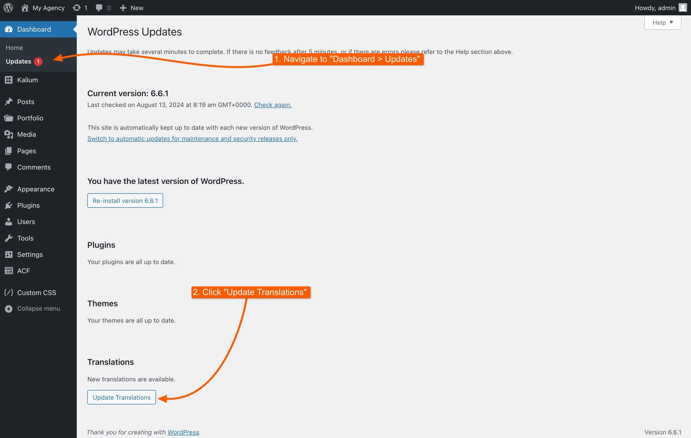

# Translation introduction

At Laborator, we recognize that our theme should cater to a diverse, global audience. To accommodate this, we have built Kalium with translation in mind, ensuring that every word and sentence can be personalized to fit various languages and locales.

Whether your site is in a single language or supports multiple languages, Kalium provides flexible options for translation.

### Available Languages

Kalium comes with built-in support for 30 languages, so you can easily switch your site to one of these languages. The theme strings and words are translated for all these languages, but this does not mean that Kalium is limited to just these languages. The theme can be used with any language in the world, and you can translate it manually using tools which we'll mention later below.

The available languages include:

| :flag\_de: German       | :flag\_at: German _(AT)_ | :flag\_ch: German _(CH)_     |
| ----------------------- | ------------------------ | ---------------------------- |
| :flag\_fr: French       | :flag\_es: Spanish       | :flag\_al: Albanian          |
| :flag\_it: Italian      | :flag\_nl: Dutch         | :flag\_be: Dutch _(BE)_      |
| :flag\_cn: Chinese (CN) | :flag\_jp: Japanese      | :flag\_kr: Korean            |
| :flag\_se: Swedish      | :flag\_gr: Greek         | :flag\_ru: Russian           |
| :flag\_pl: Polish       | :flag\_lt: Lithuanian    | :flag\_bg: Bulgarian         |
| :flag\_si: Slovenian    | :flag\_pt: Portuguese    | :flag\_br: Portuguese _(BR)_ |
| :flag\_no: Norwegian    | :flag\_tr: Turkish       | :flag\_cz: Czech             |
| :flag\_fi: Finnish      | :flag\_sk: Slovak        | :flag\_ro: Romanian          |
| :flag\_hu: Hungarian    | :flag\_dk: Danish        | :flag\_ua: Ukrainian         |

To switch to one of the available languages:

1. Go to **Settings -> General** in your WordPress dashboard.
2. Change the **Site Language** to the desired language (e.g., Deutsch for German).
3. After a few minutes, check for updates under **Dashboard -> Updates**. Install the updates to apply the translations.

<figure><figcaption></figcaption></figure>

If you find any translation that doesn’t seem accurate, please report it on our [support forum](https://laborator.ticksy.com/).

***

### Single Language Sites

If your site operates in a single language, you’ll need to translate only the theme strings, you can use one of the following methods:

* **WordPress Plugin**: Use plugins like [Loco Translate](https://wordpress.org/plugins/loco-translate/) to translate strings directly from your WordPress dashboard. [translating-with-loco-translate.md](translating-with-loco-translate.md "mention")
* **App**: Use applications like [Poedit](https://poedit.net/) to manually edit and translate the theme's `.po` files. [translating-with-poedit.md](translating-with-poedit.md "mention")

These methods will help you translate and customize Kalium for any language.

***

### Multi-Lingual Sites

If you need your site to support multiple languages, you’ll need a multilingual plugin. There are several options available to help you achieve this:

* [**WPML**](https://kaliumtheme.com/go/wpml): A paid plugin that allows full translation of theme strings, pages, posts, and more. It’s thoroughly tested with Kalium and offers the most reliable experience. [translating-with-wpml.md](translating-with-wpml.md "mention")
* [**Polylang**](https://wordpress.org/plugins/polylang/): A freemium plugin offering basic multilingual features for free, with the option to unlock advanced functionalities through paid add-ons.
* [**Weglot**](https://kaliumtheme.com/go/weglot): This plugin provides instant translation with the option to manually adjust translations. It’s free for small sites, but you’ll need a paid plan for larger projects.

Each of these plugins can help you create a multilingual site, but for the best results, we recommend WPML due to its full compatibility and proven reliability with Kalium.

***

### Contributing to Translations

We are committed to making Kalium accessible in as many languages as possible, but translating the theme into every language is an ongoing effort. If you'd like to contribute to translating Kalium into a language that isn't fully supported yet or suggest improvements, we invite you to join our translation community:

1. Visit our [Kalium Translation Portal](https://translate.kaliumtheme.com/projects/kalium/) powered by GlotPress.
2. You can translate theme files directly through the platform or propose changes to existing translations.
3. Your contributions will be reviewed, and approved translations will be credited in the theme changelog.

Thank you for helping us enhance Kalium's accessibility for users around the world!
