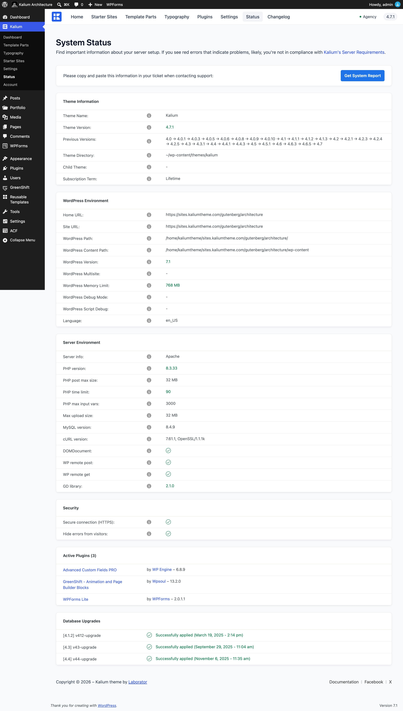

# Where to Start

Most problems with a WordPress site come from a small number of causes, and they're the same causes over and over. Working through them in order will resolve the majority of issues before you need to contact anyone.

***

### Start here: the four checks

Do these first, in this order. They fix more problems than everything else on this page combined.

#### 1. Clear every cache

Your caching plugin, your host's own cache, and any CDN such as Cloudflare. Then reload the page with a hard refresh (**Ctrl+Shift+R**, or **Cmd+Shift+R** on a Mac).

A surprising number of "the theme is broken" reports are a browser or a CDN showing yesterday's files.

#### 2. Update your plugins

Open **Kalium -> Plugins** and update anything with a newer version available. A theme update often expects newer plugins than you have installed.

#### 3. Check Kalium -> Status

This screen tells you your PHP version, your memory limit, whether your license is active, and whether your server can reach the internet.

Kalium needs **PHP 7.4 or newer** and **at least 128 MB of memory**. Many problems are a server below those numbers.

<figure><figcaption></figcaption></figure>

#### 4. Turn off CSS and JavaScript optimization

In WP Rocket, Autoptimize, LiteSpeed Cache or similar, temporarily switch off **minify**, **combine** and **delay JavaScript**, then reload.

If the problem disappears, turn the settings back on one at a time until it returns. You've found the cause.


These optimization features work by rewriting your site's code, and sometimes they rewrite it wrongly. They're the most common cause of "it worked yesterday" problems that aren't caching.


***

### Find your problem


[after-an-update.md](after-an-update.md)



[critical-errors.md](critical-errors.md)



[starter-site-imports.md](starter-site-imports.md)



[settings-not-applying.md](settings-not-applying.md)



[header-and-menus.md](header-and-menus.md)



[mobile-problems.md](mobile-problems.md)



[image-problems.md](image-problems.md)



[shop-problems.md](shop-problems.md)



[plugin-conflicts.md](plugin-conflicts.md)



[license-and-activation.md](license-and-activation.md)



[child-theme-problems.md](child-theme-problems.md)



[manage-options-in-customizer.md](manage-options-in-customizer.md)



[bad-hosting-environment.md](bad-hosting-environment.md)


***

### The two-minute conflict test

When you can't tell what's causing something, this finds it quickly:

1. **Switch off all plugins** except the ones Kalium needs. Does the problem stop?
2. If yes, turn them back on **one at a time**, checking after each. The one that brings the problem back is your answer.
3. If no, switch to a default WordPress theme like Twenty Twenty-Four. If the problem persists there too, it isn't the theme.

Do this on a staging copy if you have one. If you don't, do it at a quiet time, visitors will see the site change while you work.

***

### Before contacting support

Having these ready will get you a useful answer much faster:

* **What you see**, and on which page, a link helps
* **What you expected instead**
* **When it started**, and what changed around then, an update, a new plugin, a migration
* **A screenshot of Kalium -> Status**
* **Whether the four checks above changed anything**


If your site is completely down and you can't reach your admin at all, go straight to [Critical Errors](critical-errors.md), it covers getting back in.

