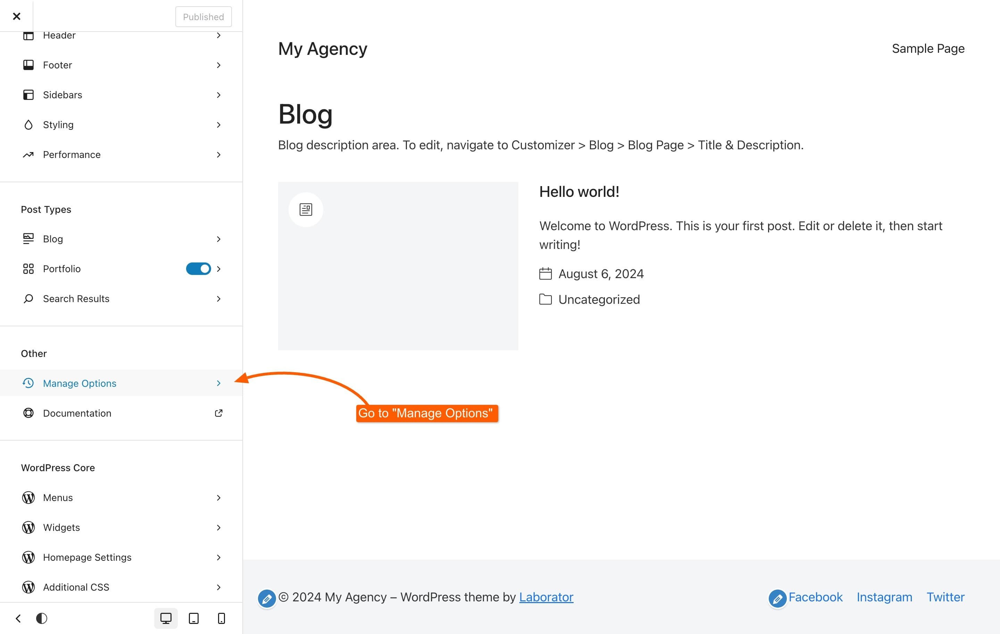
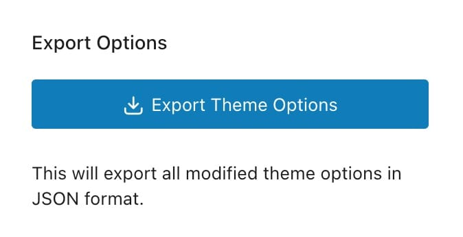
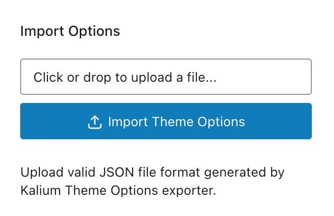
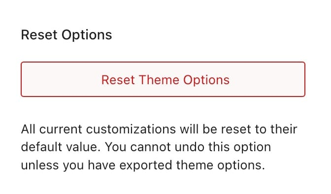

# Manage Options in Customizer



The Manage Options feature in the Customizer allows you to efficiently handle your customization settings, this section provides tools for exporting, importing, and resetting your customizer options. It is especially useful when you want to transfer settings between sites or revert to the default configuration. Here’s a detailed guide on how to use these features:

### Accessing Manage Options

To access the **Manage Options** section:

1. Navigate to **Appearance -> Customize** in the WordPress dashboard.
2. Select **Manage Options** from the Customizer menu.

<figure><figcaption></figcaption></figure>

### Exporting Options

Exporting your customizer settings allows you to save your current configuration and transfer it to another site or create a backup. Follow these steps to export your settings:

<figure><figcaption></figcaption></figure>

1. **Go to Export Section:**
   * In the **Manage Options** panel, locate the **Export** section.
2.  **Export Settings:**

    * Click the **Export Theme Options** button.
    * A JSON file containing all your current customizer settings will be downloaded to your computer.

    This file can be used to import the settings into another site or as a backup.

### Importing Options

Importing settings is useful for applying previously exported configurations to a new site or restoring settings from a backup. Here’s how to import your customizer settings:

<figure><figcaption></figcaption></figure>

1. **Go to Import Section:**
   * In the **Manage Options** panel, find the **Import** section.
2. **Upload File:**
   * Drag and drop the exported JSON file into the input field, or click to select the file from your computer.
   * Click the **Import Theme Options** button to upload and apply the settings.

### Resetting to Default

If you wish to revert all customizer settings to their default state, you can reset them. This option is useful if you want to start fresh or undo all customizations. Follow these steps to reset your settings:

<figure><figcaption></figcaption></figure>

1. **Go to Reset Section:**
   * In the **Manage Options** panel, locate the **Reset** section.
2. **Reset Settings:**
   * Click the **Reset Theme Options** button. This will revert all customizer options to their default values.
   * A confirmation popup will appear with the message: **"Are you sure you want to reset theme options? This action is irreversible!"**, click **OK** to proceed.


**CAUTION**: This action cannot be undone. All your current customizations will be lost, so ensure you have exported or backed up any important settings before proceeding.


