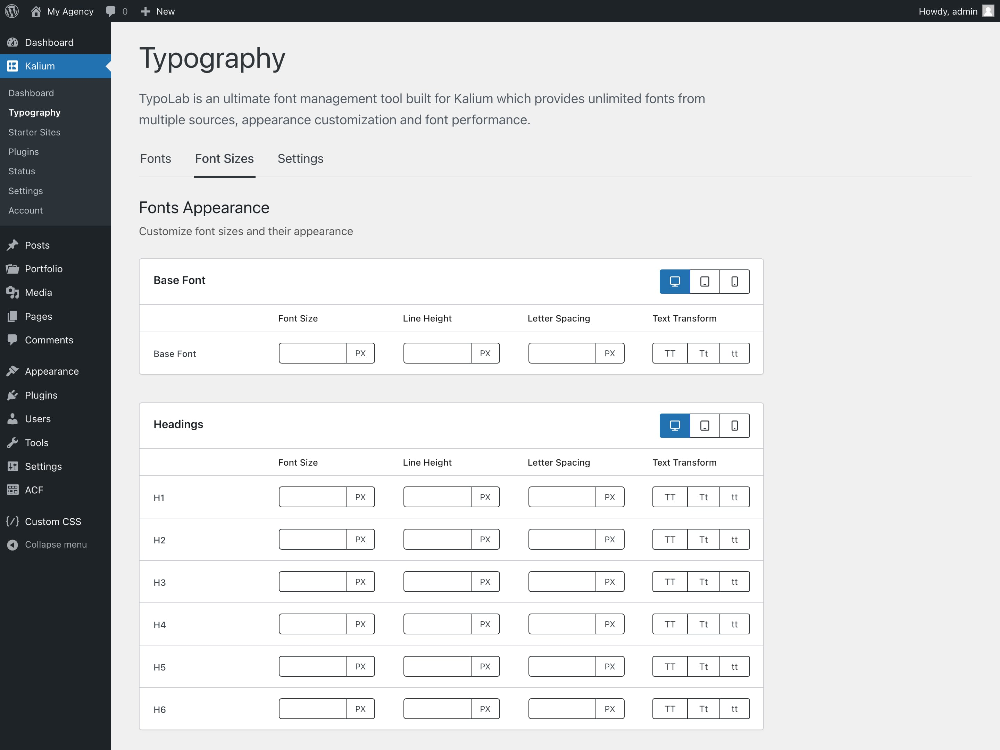
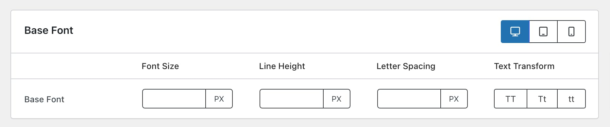
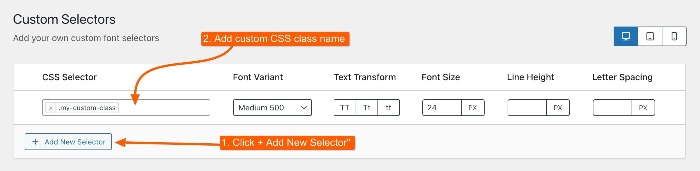

# Font Sizes

Managing font sizes is important for a clean and consistent look on your site. The Font Sizes tab settings let you adjust how text appears across your website, including font size, line height, and letter spacing. Here’s a simple guide to help you customize these settings.

<figure><figcaption></figcaption></figure>

### Font Sizes

You can change the font sizes for different parts of your site, including headings, paragraphs, and other text elements. This setting ensures that your typography scales appropriately across different sections of your site.

### Line Height

Adjust the line height to control the vertical spacing between lines of text. This setting helps improve readability and ensures that text is properly spaced.

### Letter Spacing

Set the letter spacing to control the horizontal space between characters. This can enhance the overall readability and visual impact of your text.

### Text Transform

The Text Transform option allows you to adjust the case of your text, such as making it uppercase, lowercase, or capitalizing the first letter of each word. This helps with styling and consistency across your content.

### Units

You can select from various units for font sizes, line height, letter spacing, and text transform, including:

* **PX** (Pixels)
* **EM** (Relative to the font size of the element)
* **REM** (Relative to the root element’s font size)
* **PT** (Points)
* **%** (Percentage)
* **VW** (Viewport Width)

Alternatively, you can use the global unit setting available under [**Kalium -> Typography -> Settings** **->** **Default Unit**](typography-settings.md#default-unit) to standardize the unit across your site.

### Responsive Options

Each section for font sizes, line height, letter spacing, and text transform includes responsive options for different devices:

* **Desktop**
* **Tablet**
* **Mobile**

This ensures that your typography adjusts appropriately for various screen sizes and devices, providing a seamless experience for all users.

By adjusting these settings, you can ensure that your site's typography is not only visually appealing but also consistent and responsive across different devices.

***

### Base Font

<figure><figcaption></figcaption></figure>

The **Base Font** section allows you to set the root font size for the site. This is particularly important when using relative units such as **EM**, **REM**, and **%**, as these units are based on the base font size. By defining the base font size, you ensure that all relative font sizes scale appropriately across your site. This setting provides a consistent typographic scale and helps maintain readability.

Adjusting the base font size affects how other font sizes are calculated when using relative units. For example, if you set the base font size to 16px, a font size of 1.5rem will be 24px (1.5 times the base size). This consistency is crucial for responsive design, ensuring that text remains proportionate and legible across different devices.

***

### How Can I Set a Specific Font Size for a Selector on the Site?

To customize the font size for a specific CSS class on your site, follow these simple steps:

* Go to **Kalium -> Typography -> Fonts**.
* Select the font you’re using from the list.
* Scroll down to **Custom Selectors**.
* Click on **+ Add New Selector**.
* Enter your desired class name, for example, `.my-custom-class`.
* Set the font size and other settings as needed.
* Save changes

<figure><figcaption></figcaption></figure>

By doing this, you can easily apply custom font sizes and other styling to specific elements on your site by targeting their CSS class. By using Inspect Element, you can accurately identify and target the exact area where you want to apply custom font sizes and other styling adjustments.

#### Targeting a Specific Area Using Inspect Element

To apply the font size to a specific area on your site, you first need to identify the CSS class used for that area. Here’s how to do it:

1. **Right-click on the area** of your site where you want to apply the custom font size.
2. **Select "Inspect"**  or "Inspect Element" from the context menu . This will open the browser’s developer tools.
3. **Look for the CSS class** applied to the selected element in the HTML structure on the left side of the developer tools.
4. **Copy the class name**. For example, you might see something like `
`.
5. **Use this class name** (e.g., `.header-title`) when adding a new selector in the Font settings.
6. **Follow the steps** to add a new selector and set the font size for this class.

