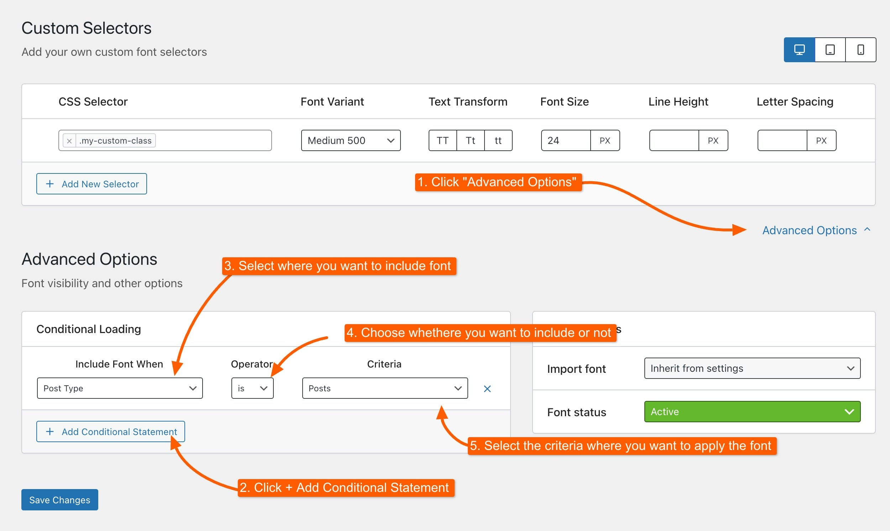

# Advanced Settings

Here, you can manage advanced options to customize the font experience, including when to load the font and how to override default font settings. This section is ideal for users who need specific configurations for different parts of their site or want to optimize font loading performance.

***

### Conditional Loading

Configure when to include the font on specific pages, posts, or other post types. You can also exclude it from certain areas if needed:

<figure><figcaption></figcaption></figure>

**Every font on a page has to be downloaded before text appears in it.** A font used on one landing page but loaded on all 200 pages of your site is 200 pages paying for something one of them uses.

Conditional Loading fixes that: load the font only where it's needed.

#### When it's worth using

**A display font used on one page.** A bold decorative font on the home page, loaded nowhere else.

**A font for the shop only.** Loaded on product and shop pages, skipped on the blog.

**A font for one language**, on a multilingual site.

#### When to leave it alone

If a font is used across your whole site (your body text, your headings) leave Conditional Loading off. Restricting it just means some pages render with the wrong font until it arrives.


**Your font disappeared from some pages?** Check here first. A Conditional Loading rule that's narrower than you meant is the usual cause.


***

### Other Options

Three settings that overwrite, for this font alone, what [Font Preload](../typography-settings.md#font-preload) and [Font Import Placement](../typography-settings.md#font-import-placement) set for every font. Both start on **Inherit from settings**, which is what sends them back to **Kalium -> Settings -> Typography**.

#### Font preload

Tells the browser to start downloading the font immediately rather than waiting until it discovers the text that needs it. **Inherit from settings**, **Yes** or **No**.

**Worth turning on for the font your visitors see first**\
Your body text, or your main heading font. Preloading everything defeats the purpose, since the browser then has several things all competing to be first.


**This row only appears on Self-Hosted fonts.** Preloading needs a font file to point at, so Google, Adobe, External, Premium and System fonts have nothing to preload and the setting is not offered for them.


#### Import font

Where the font's loading instruction is placed in the page: **Inherit from settings**, **Before page renders (Inside `<head>`)** or **After page renders (Inside `<body>`)**. The site-wide default suits most fonts; change it here only when one font needs to load differently from the rest.

#### Font status

**Active** or **Inactive**.

Setting a font to Inactive stops it loading without deleting it, useful for testing whether a font is causing a problem, or keeping a font you may want back later.


**Turning a font off is the quickest way to test it.** If a font isn't behaving, set it Inactive and reload. If the problem goes, you've found it. Nothing is lost, set it back to Active.


***

### Getting fonts to load faster

If text is slow to appear on your site:

**Reduce the variants you load.** Each weight and style is a separate download. Most sites need Regular and Bold, and nothing else. Loading nine weights when you use two is the most common cause of slow text.

**Turn on Pull Google Fonts** in **Kalium -> Settings -> Typography**. This serves Google Fonts from your own server instead of Google's, which is faster and better for privacy.

**Turn on Font preload** for the self-hosted font used above the fold.

**Consider System Fonts** for body text. They load instantly because they're already on the visitor's device.


[typography-settings.md](../typography-settings.md)


***

### Common questions

**My font doesn't appear on some pages.**\
A Conditional Loading rule is excluding them.

**My font doesn't appear anywhere.**\
Check its **Status** is Active, that it has at least one selector, and clear your caches.

**Preload isn't making any difference.**\
Preloading applies to Self-Hosted fonts only, so check the font's type first. Beyond that it helps most when applied to one or two fonts: if every font is preloaded, none of them is prioritized.


[settings-not-applying.md](../../troubleshooting/settings-not-applying.md)

