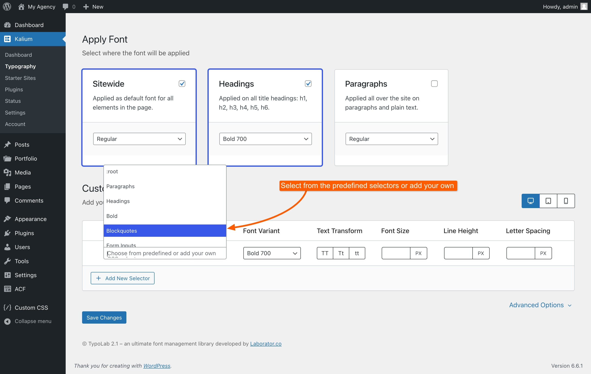

# Custom Selectors

In this section, you can apply the font to specific areas of your site by choosing from the list of pre-defined selectors or by entering a relevant CSS class or ID. This feature gives you precise control over where the font appears on your site.

For example, if you want all blockquotes to be bold and use a specific font, you can select this option from the pre-defined templates. This way, every blockquote across your site will automatically adopt the font settings you've chosen, such as making it bold. This granular control helps you ensure that the font is used exactly where and how you need it.

<figure><figcaption></figcaption></figure>

Keep in mind that if you change the font size here, it will override the default "Font Sizes" settings. For those new to CSS, it's advisable to first review the "Font Sizes" tab to understand the basics.
