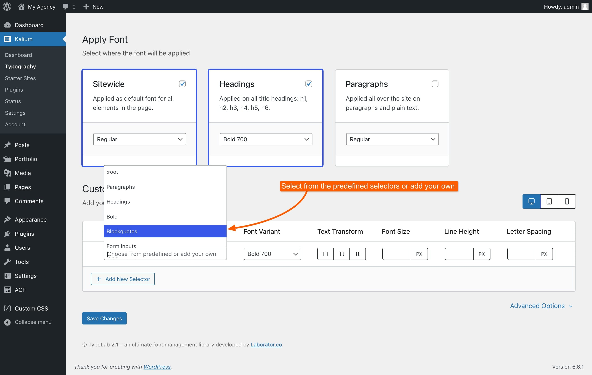

# Custom Selectors

In this section, you can apply the font to specific areas of your site by choosing from the list of pre-defined selectors or by entering a relevant CSS class or ID. This feature gives you precise control over where the font appears on your site.

For example, if you want all blockquotes to be bold and use a specific font, you can select this option from the pre-defined templates. This way, every blockquote across your site will automatically adopt the font settings you've chosen, such as making it bold. This granular control helps you ensure that the font is used exactly where and how you need it.

<figure><figcaption></figcaption></figure>

Keep in mind that if you change the font size here, it will override the default "Font Sizes" settings. For those new to CSS, it's advisable to first review the "Font Sizes" tab to understand the basics.

***

### The pre-defined selectors

You don't need to know any CSS to use these. Each one covers a common part of a page:

**Sitewide**\
Everything. This is the base font, and every other selector overrides it where it applies.

**Paragraphs**\
Body text.

**Headings**\
All headings, H1 to H6 together. For individual heading levels, use **Font Appearance** instead.

**Bold**\
Anything emphasized in bold.

**Blockquotes**\
Quoted passages.

**Form Inputs**\
Text fields, dropdowns and buttons in forms.

***

### How fonts stack

**Fonts are applied in the order they appear in your list**, so later fonts win where they overlap.

A font set to **Sitewide** is the base for everything. A second font set to **Headings** overrides it there and leaves the rest alone. That's the normal setup for most sites: one font for reading, one for headings.

**To change which font wins**, reorder them in the list. The order in the list is the order they're applied.


**Your font isn't applying anywhere?** It probably has no selector at all. A font with no selector is loaded but never used.


***

### Writing your own selector

When none of the pre-defined options covers what you want, type a CSS selector yourself.

Some that come up often:

| To target | Type |
| --- | --- |
| A class you've added | `.my-class` |
| A specific element by ID | `#my-element` |
| A particular heading level | `h2` |
| Everything inside the footer | `.site-footer` |
| Links inside body text | `.entry-content a` |

**To find the right selector**, right-click the text on your site and choose **Inspect**. Your browser shows the element's classes, and you can use one of those.


A selector that's too broad can catch more than you intended, `div` or `span` will apply your font almost everywhere. Start specific and widen only if you need to.


***

### Selectors vs. Font Appearance

There are two ways to say where a font goes, and they're easy to confuse.

**Custom Selectors**\
On the font itself. Best for broad, structural choices: all headings, all body text, all quotes.

**Font Appearance**\
A separate screen listing **66 named places** in the theme, grouped by area: individual heading levels, the header menu, the mini cart, the footer, the product page, buttons. Best when you want to change one specific thing without writing a selector.

If you're trying to change the font on the mobile menu or the product title, Font Appearance almost certainly has it listed by name.


[typography-settings.md](../typography-settings.md)


***

### Sizes set here override Font Sizes

Setting a size on a selector beats what you've set under **Font Sizes**.

That's useful when you want a font to carry its own size wherever it's used. It's also the most common reason a Font Sizes change appears to do nothing.

**If your size settings are being ignored**, check whether a custom selector is setting a size for the same thing.


[font-sizes.md](../font-sizes.md)


***

### Common questions

**My font doesn't appear on the site.**\
Check it has at least one selector, that its status is Active, and clear your caches.

**Two fonts are fighting.**\
Reorder them in the list, the later one wins.

**The size is ignored.**\
Something more specific is winning: a Font Appearance element, another font's custom selector, or a page builder's own typography settings on that element.

**Mobile sizes don't apply.**\
Set them on the **Mobile** breakpoint. An empty breakpoint inherits from General.
