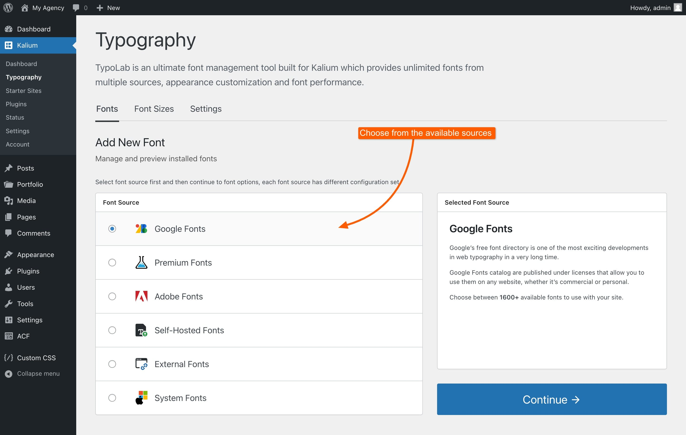
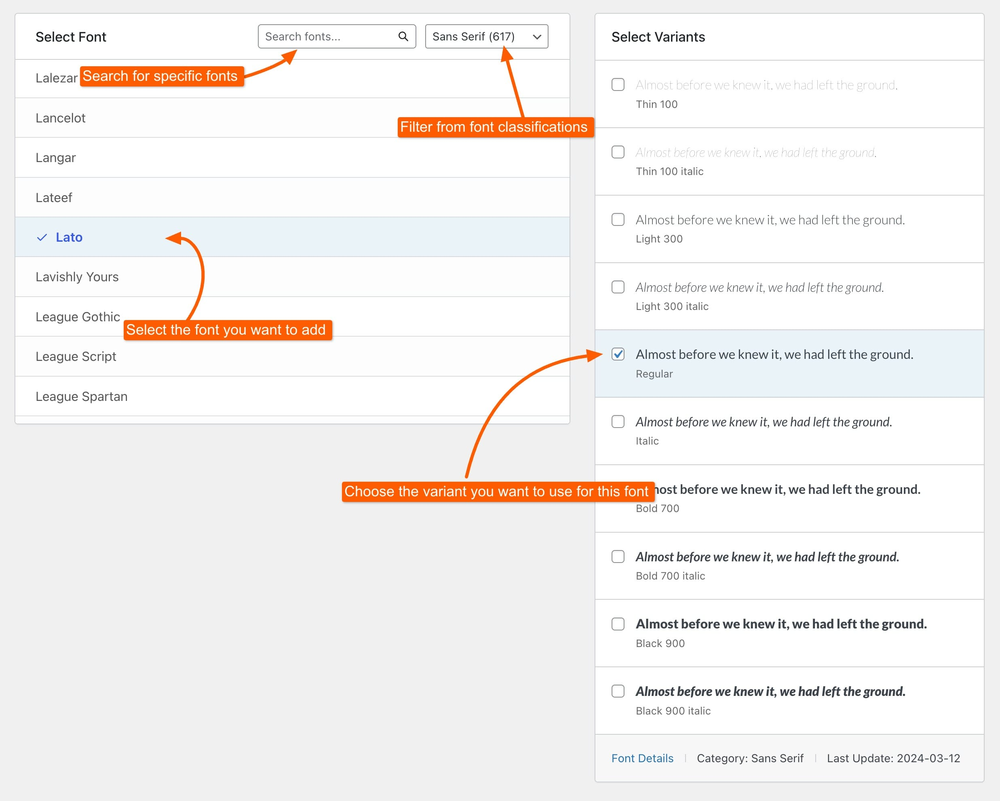

# How to Add a Font

This guide will show you how to easily add and manage fonts on your site. The steps are simple and straightforward, so you can quickly choose and apply fonts to get the look you want for your site.&#x20;

Let's add a new font, navigate to **Kalium -> Typography** from the WordPress admin dashboard.


This guide covers Google Fonts, Premium Fonts, and System Fonts. For information on [Adobe Fonts](adding-adobe-fonts.md), [External Fonts](adding-external-fonts.md), and [Self-Hosted Fonts](adding-self-hosted-fonts.md), please refer to the other articles.


### 1. Add a New Font

Click on the "**+ Add Font**" button to start adding a new font.

<figure><figcaption></figcaption></figure>

### 2. Choose the Font Source

Select the font source from the available options, such as Google Fonts, Premium Fonts, Adobe Fonts, Self Hosted Fonts, External Fonts, or System Fonts. The options you see will depend on the font source you choose.

<figure><figcaption></figcaption></figure>

### 3. Select Your Font

In the left panel, browse through the available fonts or use the search option to find a specific font. You can also filter fonts by categories such as serif or sans-serif. Once you find the font you want, select it.

<figure><figcaption></figcaption></figure>

### 4. Select Variants

On the right side, you’ll see the variant selector. Choose the specific variant of the font you wish to use, such as Regular, Bold, or Italic. If you don’t need a particular variant, it’s best not to select it, as unnecessary variants can impact your site’s performance.

### 5. Apply the Font

Decide where you want the font to be applied, such as "Sitewide," "Headings," or "Paragraphs." By default, the font will be applied sitewide. If you want to use different fonts for different sections, you can customize the settings to apply one font to headings and another to paragraphs, or adjust as needed.

<figure><figcaption></figcaption></figure>

That’s all for the basic font setup. Be sure to save your changes by clicking the **Save Changes** button. The additional options available, such as Conditional Loading and Overwriting Font Settings, are more advanced and not necessary for loading a font but can be explored if you need more control over font management.
