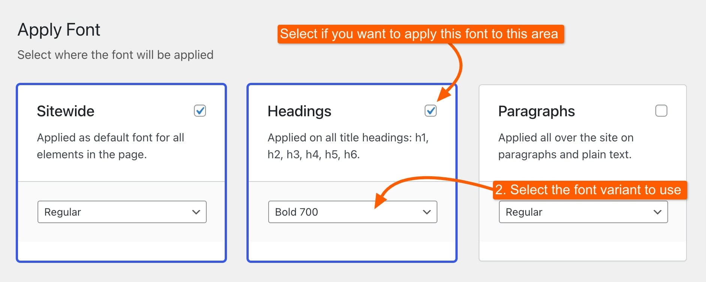

# Adding Adobe Fonts

The process of adding Adobe Fonts is quite similar to the general font adding process. By following these steps, you’ll be able to seamlessly incorporate Adobe Fonts into your site and enhance your typography.

### 1. Go to Adobe Fonts

Start by visiting [Adobe Fonts](https://fonts.adobe.com) and searching for the font you want to use on your site. Adobe Fonts offers a wide selection, so take your time to find the perfect match for your design needs.



### 2. Add to Web Project

Once you've selected a font, click the **\</> Add to Web Project** button. This will allow you to use the font on your website by linking it to a web project.

<figure><figcaption></figcaption></figure>

### 3. Create a Web Project

A new popup will appear, prompting you to add the name of your project, name the project and choose the desired font variants (e.g., Regular, Bold, Italic) for this project, then click the "**Create**" button to generate your web project.

<figure><figcaption></figcaption></figure>

### 4. Access Your API Token

Now that you've created your web project, head to the top right area of the Adobe Fonts page. Click on your profile icon, and in the dropdown menu, select "**API Tokens**." This is where you'll find the necessary API token to integrate Adobe Fonts with your site.

<figure><figcaption></figcaption></figure>

### 5. Copy Your API Token

On the API Tokens page, locate your token on the left side. Copy this token, as you'll need it to connect Adobe Fonts with your site through Kalium.

<figure><figcaption></figcaption></figure>

### 6. Integrate with Kalium

To finalize the process, navigate to **Kalium -> Typography -> Settings** in your WordPress dashboard. Paste the API token you copied into the "**Adobe Fonts API Token**" field. This will link your Adobe Fonts to Kalium, allowing you to use them on your site.

<figure><figcaption></figcaption></figure>

### 7. Add a New Font

Navigate to the **Fonts** tab under **Kalium -> Typography**, then click on the "**+ Add Font**" button to start adding a new font.

<figure><figcaption></figcaption></figure>

### 8. Choose the Font Source

Select the font source from the available options, in this case Adobe Fonts, and click "**Continue ->**".&#x20;

<figure><figcaption></figcaption></figure>

### 9. Select Your Font 

In the left panel, the fonts you've selected and added to your project in Adobe Fonts will show while in the right you will see the variants you've selected.

<figure><figcaption></figcaption></figure>

### 10. Apply the Font

Decide where you want the font to be applied, such as "Sitewide," "Headings," or "Paragraphs." By default, the font will be applied sitewide. If you want to use different fonts for different sections, you can customize the settings to apply one font to headings and another to paragraphs, or adjust as needed.

<figure><figcaption></figcaption></figure>

### Save Changes

Well done! You’ve successfully added Adobe Fonts to your site. Now, you can start applying these fonts to various elements, ensuring your site’s typography reflects the style you’re aiming for.
