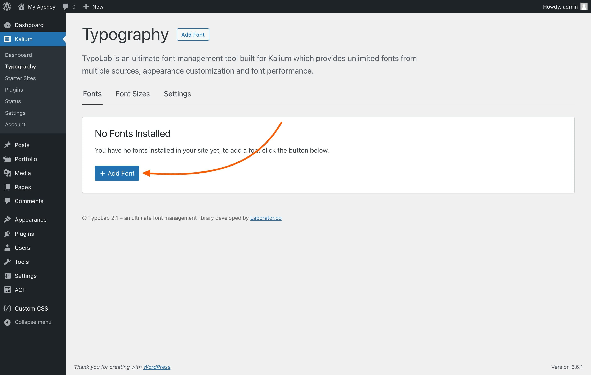

# Adding External Fonts

Adding external fonts to your site is a straightforward process that involves linking to a stylesheet containing the web fonts you want to use. This method allows you to easily integrate fonts from external sources with minimal setup.

### 1. Add a New Font

Navigate to the **Fonts** tab under **Kalium -> Typography**, then click on the "**+ Add Font**" button to start adding a new font.

<figure><figcaption></figcaption></figure>

### 2. Choose the Font Source

Select the font source, in this case **External Fonts** and click "**Continue ->**".&#x20;

<figure><figcaption></figcaption></figure>

### 3. Add the font URL&#x20;

In the “**Font Stylesheet URL**” field, you need to paste the URL of a stylesheet that includes the web fonts you want to use on your site. This stylesheet should contain `@font-face` rules, which define how the fonts are displayed.&#x20;

For example, if you are adding the Merriweather font directly from Google Fonts, you would use a URL like `https://fonts.googleapis.com/css2?family=Merriweather`.&#x20;

This URL links directly to a stylesheet that includes the necessary font declarations, ensuring that the Merriweather font is properly loaded and applied to your site.

<figure><figcaption></figcaption></figure>

### 5. Apply the Font

Decide where you want the font to be applied, such as "Sitewide," "Headings," or "Paragraphs." By default, the font will be applied sitewide. If you want to use different fonts for different sections, you can customize the settings to apply one font to headings and another to paragraphs, or adjust as needed.

<figure><figcaption></figcaption></figure>

### 6. Save Changes

After entering the stylesheet URL, click “**Save Changes**” to apply the font to your site. The font will automatically load from the external source and be available for use.
