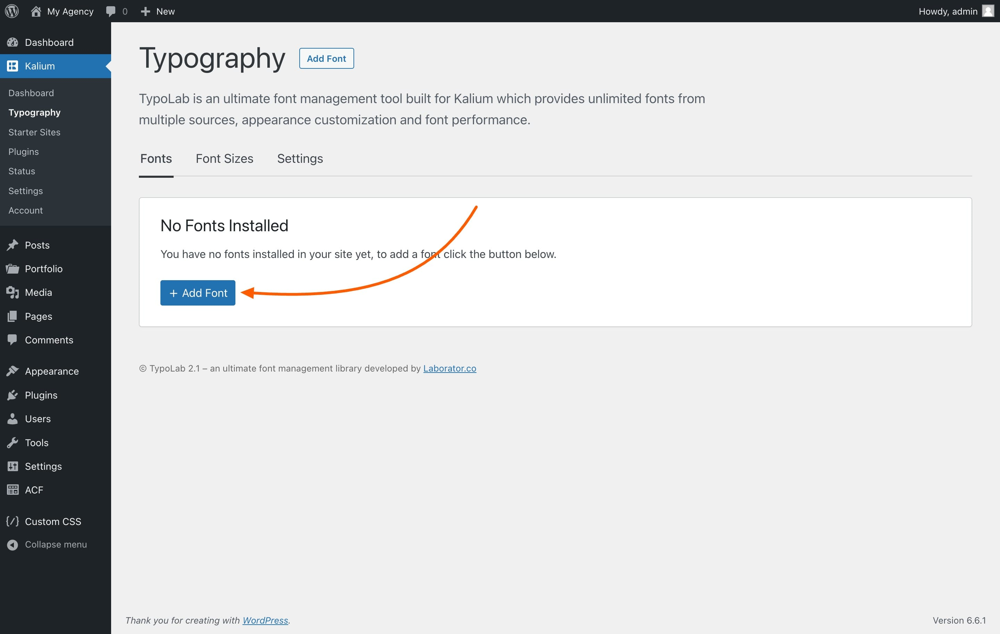
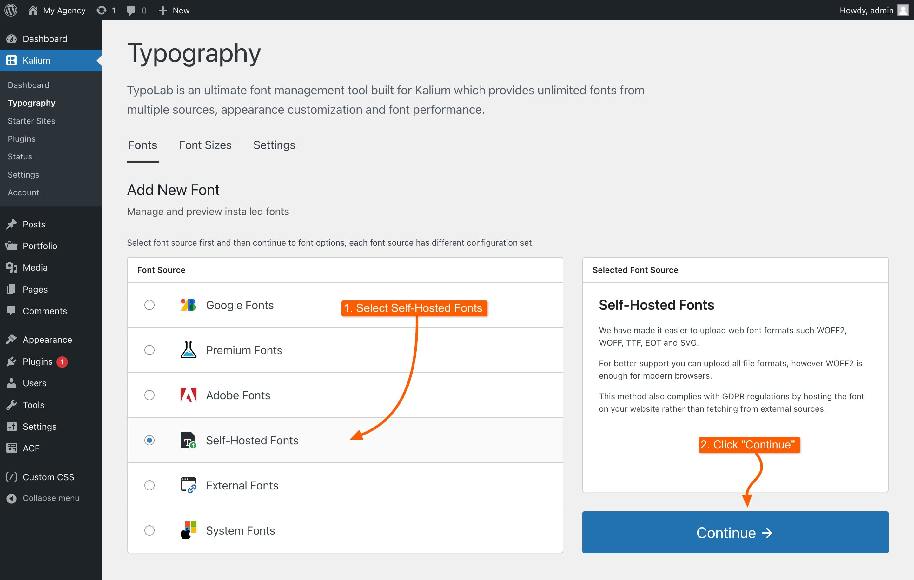
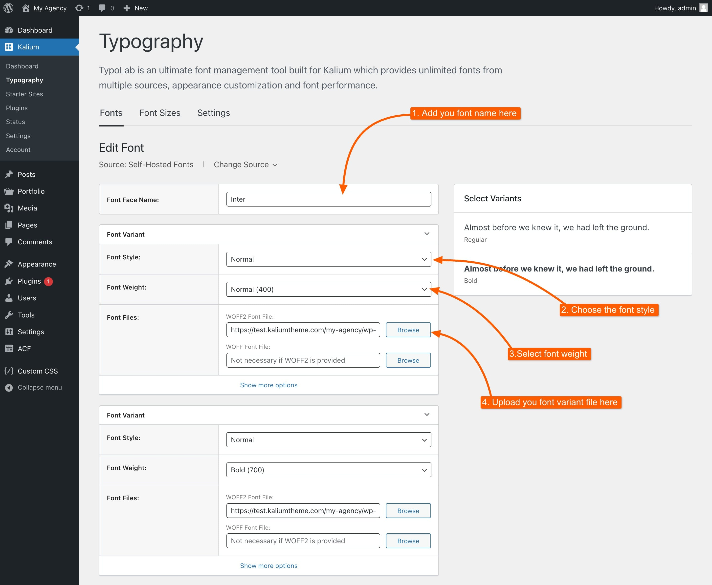
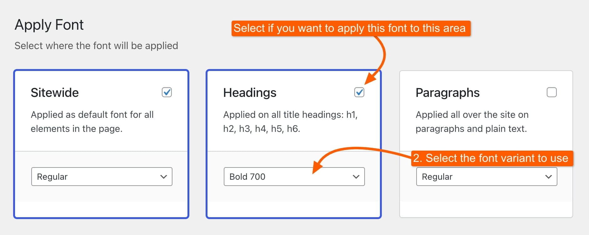

# Adding Self-Hosted Fonts

The process of adding Self-Hosted Fonts is quite similar to the general font-adding process. This method also ensures compliance with GDPR regulations by hosting the font directly on your website rather than fetching it from external sources.

By following these steps, you’ll be able to seamlessly incorporate your own fonts into your site and enhance your typography.

### 1. Add a New Font

Navigate to the **Fonts** tab under **Kalium -> Typography**, then click on the "**+ Add Font**" button to start adding a new font.

<figure><figcaption></figcaption></figure>

### 2. Choose the Font Source

Select the font source, in this case **Self-Hosted Fonts** and click "**Continue ->**".&#x20;

<figure><figcaption></figcaption></figure>

### 3. Name Your Font&#x20;

Once you’re on the self-hosted font page, start by naming the font face you will be adding. For instance, if you are uploading the "Inter" font, you will name it "Inter."&#x20;

### 4. Upload and Set Up Self-Hosted Font and Variants

Now you can set up the font style, weight, and upload the font files. You can also preview the font on the right side of the page. Here’s what you need to do:

* **Font Style**: Choose between Normal or Italic.
* **Font Weight**: Select the appropriate font weight for the variant you are uploading.
* **Font Files**: Upload the WOFF2 font file or choose it from the media library. WOFF2 is the only necessary font file; the others are optional for older browser support but not required.

<figure><figcaption></figcaption></figure>

The “**Show more options**” button is designed for advanced use only. If you click it, you’ll have the option to upload various web font formats, including WOFF, TTF, EOT, and SVG, in addition to WOFF2.

If you have additional font variants, such as Bold, you can create them by clicking the "**+ Add Font Variant**" button, the variants will show on the right area of the page where you can preview the font you've added. Once you’ve set up the font variants, click "**Save Changes**."

### 5. Apply the Font

Decide where you want the font to be applied, such as "Sitewide," "Headings," or "Paragraphs." By default, the font will be applied sitewide. If you want to use different fonts for different sections, you can customize the settings to apply one font to headings and another to paragraphs, or adjust as needed.

<figure><figcaption></figcaption></figure>

### 6. Save Changes

Finally, save your changes to apply the font to your website. Your self-hosted font is now ready to use.

Well done! You’ve successfully added a self-hosted font to your site. Now, you can start applying these fonts to various elements, ensuring your site’s typography reflects the style you’re aiming for.
