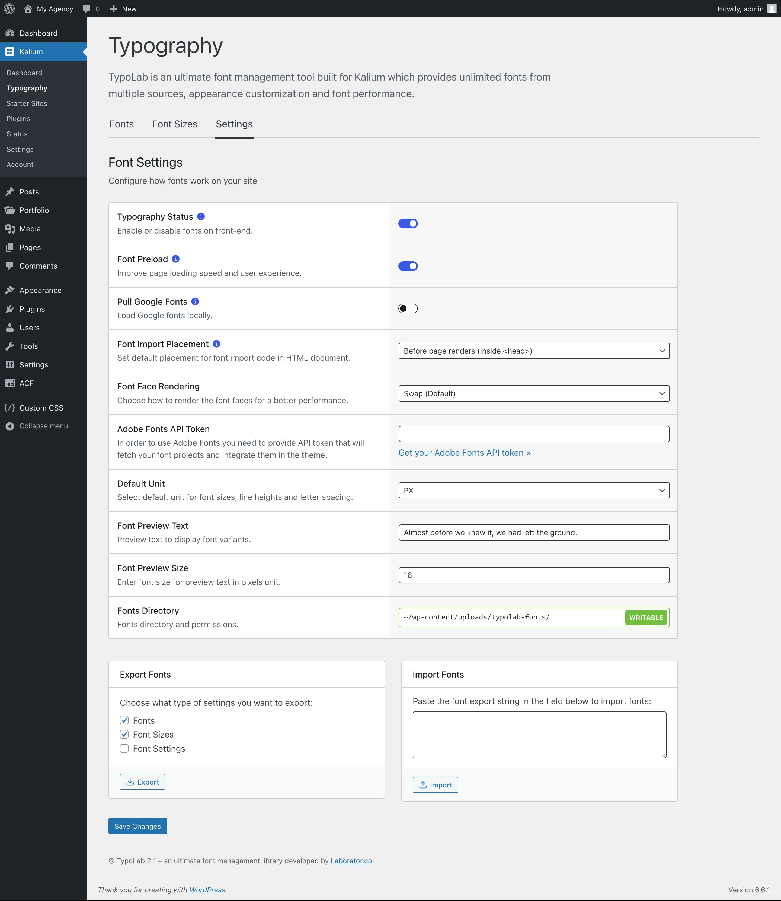

# Typography Settings

Various settings are available to help you customize the typography on your site. Here’s a look at the options for managing and adjusting your fonts

<figure><figcaption></figcaption></figure>

### Typography Status

This setting allows you to enable or disable fonts on the front end of your website. By toggling this option, you can control whether the selected fonts are applied to your site’s design.

### Font Preload

The Font Preload option helps improve page loading speed and user experience by preloading the fonts. When enabled, it loads the fonts early in the page rendering process, making sure your text displays as soon as possible.

### Pull Google Fonts

When this option is enabled, Kalium will load Google Fonts locally instead of pulling them from Google’s servers. This can help with site performance and privacy by reducing external requests.

### Font Import Placement

This setting determines where the font import code is placed within your HTML document. You can choose between:

* **Before page renders (Inside `<head>`)**: This option loads fonts before the page content is displayed.
* **After page renders (Inside `<body>`)**: This option loads fonts after the page content is displayed.

### Font Face Rendering

The Font Face Rendering setting lets you choose how to render the font faces for better performance. The available options are:

* **Swap (default)**: Ensures text is displayed using a fallback font until the custom font is fully loaded.
* **Auto**: The browser decides the best rendering method.
* **Block**: Prevents text from being displayed until the custom font is fully loaded.
* **Fallback**: Uses a fallback font initially, then swaps to the custom font.
* **Optional**: Similar to fallback, but with less priority on loading the custom font.

### Adobe Fonts API Token

To use Adobe Fonts with Kalium, you need to provide an Adobe Fonts API token. This token fetches your font projects and integrates them into the theme, allowing you to utilize Adobe’s extensive font library.

### Default Unit

This option allows you to set the default unit for font sizes, line heights, and letter spacing. You can choose between units like pixels (px), em, or rem, depending on your design preferences.

### Font Preview Text

Here, you can enter custom text that will be displayed as a preview when selecting different font variants. This allows you to see how your chosen fonts will appear with your specific text.

### Font Preview Size

This setting lets you specify the font size, in pixels, for the preview text. Adjusting this helps you better visualize how the font will look in different sizes.

### Fonts Directory

The Fonts Directory option shows you where your fonts are stored and managed. The default directory is: `~/wp-content/uploads/typolab-fonts/` This is where your locally stored fonts are kept and where you can manage permissions for font usage.

### Export Fonts

The Export Fonts section allows you to export various font settings, making it easy to back up or transfer your typography setup. You can choose to export:

* **Fonts**
* **Font Sizes**
* **Font Settings**

Simply click the **Export** button to generate an export string.

### Import Fonts

In the Import Fonts section, you can paste an export string from another site or backup to import your font settings. This makes it simple to replicate typography settings across multiple sites.

These typography settings give you granular control over how fonts are managed, rendered, and displayed on your site, ensuring a consistent and professional appearance.
